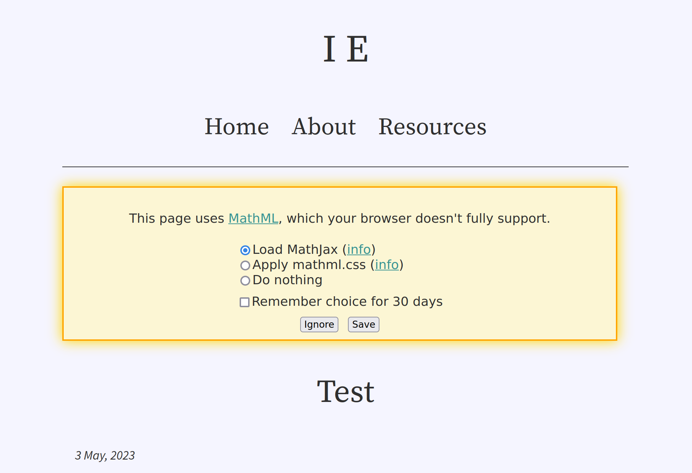

  

  I've just finished migrating this site from [Jekyll](https://jekyllrb.com/) to
  [Hakyll](https://jaspervdj.be/hakyll/). The only noticeable changes are: *slightly* prettier page URLs, MathML support, and
  tweaks to syntax highlighting to compensate for using [Pandoc](https://pandoc.org). I paid
  special attention to preserving the [Atom feed](/feed.xml) identifiers so that feed readers aren't
  impacted.

  You can find the source code at <https://github.com/LightAndLight/lightandlight.github.io/>.

  

  
<!-- generated -->

## Background

I've been using Jekyll to generate my blog because that's what [GitHub
Pages](https://pages.github.com/) recommended when I first set things up. Recently I've been working
on a math-heavy post, and I decided that I wanted [MathML](https://developer.mozilla.org/en-US/docs/Web/MathML)
support for this site. I started exploring possible solutions, and found [`texmath`](https://github.com/jgm/texmath),
which I then learned is used in [Pandoc](https://pandoc.org/) to [convert TeX to
MathML](https://pandoc.org/MANUAL.html#math-rendering-in-html). I know Hakyll has good Pandoc support, and
Haskell is one of my main languages, so I decided to make the switch[^no-jekyll-results].

## Changes

### Prettier URLs

Change: removed trailing slashes from many blog page URLs (e.g.
from `https://blog.ielliott.io/test-post/` to `https://blog.ielliott.io/test-post`).

Static site generators create HTML files, which typically have file paths ending in `.html`. Web servers
often map URL paths to filesystem paths to serve files, leading to many URLs ending in
`.html`. I don't like this; `.html` offers me no useful
information. And if it *does* coincide with the resource's file
type, [that is subject to change](https://www.w3.org/DesignIssues/NameMyth.html#Why).

My Jekyll-based site had "extension-less URLs" (which I call "pretty URLs"), but I
consistently used a trailing slash at the end of every URL (e.g.
`https://blog.ielliot.io/test-post/`). These days I prefer to use a trailing
slash to signify a "directory-like resource", under which other resources are "nested". This aligns with the convention where web servers serve `/index.html` when `/` is
requested. My blog posts don't need an index because they're self contained, so their URLs shouldn't
have a trailing slash.

[GitHub Pages supports extensionless HTML pages](https://rsp.github.io/gh-pages-no-extension/index),
serving file `x.html` when `x` is requested, so I removed the trailing slash from each page's
canonical path and make Hakyll generate a file ending in `.html` at that path 
([`site.hs#L127`](https://github.com/LightAndLight/lightandlight.github.io/blob/a29bac1b084b86abe43e28c4062ca963d0647b98/site.hs#L127),
[`site.hs#L322-L333`](https://github.com/LightAndLight/lightandlight.github.io/blob/a29bac1b084b86abe43e28c4062ca963d0647b98/site.hs#L322-L333)).

By default, Hakyll's `watch` command doesn't support pretty URLs. For a little while, I manually
added `.html` to the URL in the address bar whenever I clicked a link in my site's preview. I got sick of
this and changed the configuration to resemble GitHub Pages' pretty URL resolution rules
([`site.hs#L30-L55`](https://github.com/LightAndLight/lightandlight.github.io/blob/a29bac1b084b86abe43e28c4062ca963d0647b98/site.hs#L30-L55)).
I realised how fortunate it was that I could make this change; the relevant Hakyll changes were only
[released a week ago!](https://hackage.haskell.org/package/hakyll/changelog#hakyll-41600-2023-04-27)

### MathML support

Changes:

* Equations are compiled to MathML
* MathJax is never automatically loaded
* Browsers with poor MathML support display a warning and some options for improvement

I'm becoming more aware of sites that use unnecessary JavaScript. I realised that my blog's use of
MathJax for client-side equation rendering was an example of this. The equations on my blog are static; all the information required to
render them is present when I generate the site, so I should be able to compile the equations once and
serve them to readers. Client-side MathJax is
better suited for fast feedback on dynamic equations, like when someone types an equation into a text
box.

I played with compiling LaTeX equations to SVGs
([`latex2svg.py`](https://github.com/LightAndLight/latex4web/blob/552cf33a02b9644ca4cd6987d920af88e2759e95/latex2svg.py),
[`latex2svg.m4`](https://github.com/LightAndLight/latex4web/blob/552cf33a02b9644ca4cd6987d920af88e2759e95/latex2svg.m4)),
but realised it would be hard to make that
[accessible](https://www.w3.org/WAI/fundamentals/accessibility-intro/). I then
came across [MathML](https://developer.mozilla.org/en-US/docs/Web/MathML) and realised that it was the right solution.

MathML [still isn't ubiquitous](https://caniuse.com/mathml), so I added a [polyfill
script](https://github.com/LightAndLight/lightandlight.github.io/blob/2124670c349ce879a441ea01b19cbdfe42c031bf/js/mathml-polyfill.js)
based on <https://github.com/fred-wang/mathml-warning.js>. If you view
a math post in a web browser with limited MathML support, you'll be prompted to
improve the experience by loading external resources:

### Syntax highlighting

Change: slightly different syntax highlighting.

Pandoc does syntax highlighting differently to Jekyll, and I prefer Jekyll's output. I'll explain
why in another post. The consequence is that I had to rewrite my syntax highlighting stylesheet, and
code might look a little different due to the way Pandoc marks it up. 

## Thoughts

I had to reimplement a few things that Jekyll did for
me, like the [sitemap](/sitemap.xml)
([`site.hs#L196-206`](https://github.com/LightAndLight/lightandlight.github.io/blob/a29bac1b084b86abe43e28c4062ca963d0647b98/site.hs#L196-L206))
and previous/next post links
([`site.hs#L240-L260`](https://github.com/LightAndLight/lightandlight.github.io/blob/a29bac1b084b86abe43e28c4062ca963d0647b98/site.hs#L240-L260)).
I didn't have to create the Atom feed from scratch, though: [Hakyll has a module for that](https://hackage.haskell.org/package/hakyll-4.16.0.0/docs/Hakyll-Web-Feed.html). The whole process was pretty involved (a few days of work) and I
think I only had the appetite for it because I'm currently not working.

This is the most time I've spent working on a Hakyll site, and I think I've crossed an "inflection
point" in my understanding of the library. I can now build features from scratch instead of searching for recipes on the internet. Normally I would approach a static site generator with some impatience,
wanting to "get things done" so that I can return to what I find interesting. This time around, I
decided to do a deep dive and I gained a lot of experience.

I'm glad I made the switch. While Pandoc has a few annoying issues, I'm not
discouraged from fixing them like I would be if I found a problem with Jekyll.
Being proficient with Haskell, fixing these issues would just be a variation on normal software
development for me.

[^no-jekyll-results]: Also, there were no satisfying search results for how to do this with Jekyll.