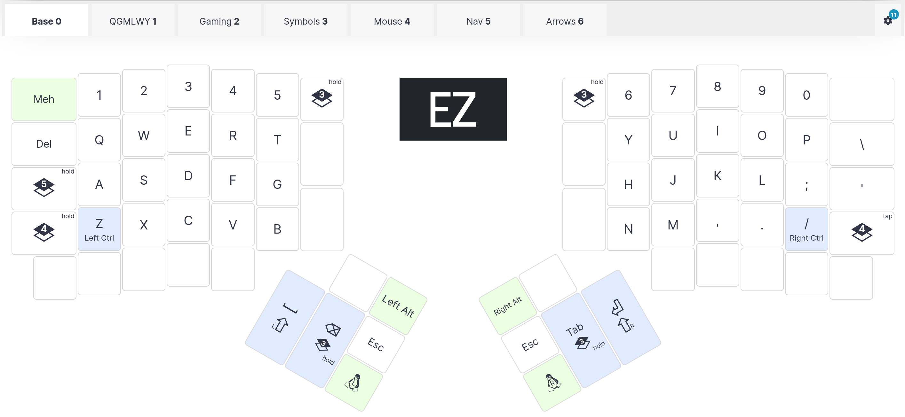
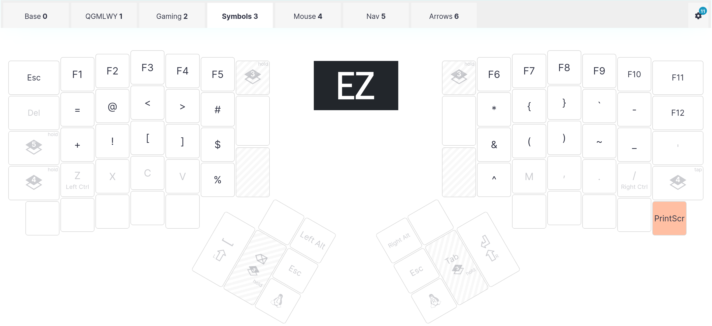

[ZSA](https://www.zsa.io) makes ergonomic keyboards.
I own two of their [Ergodox EZ](https://ergodox-ez.com/)s (one for work, one for home) which I use every day.
They also publish an [email newsletter](https://www.zsa.io/the-ergo) that I subscribe to and happily read.
In the [December 2024 issue](https://mailchi.mp/zsa/the-ergo-75), they noted that ZSA doesn't advertise (see [Why trust us | zsa.io](https://www.zsa.io/trust)), and essentially rely on recommendations from customers.
I like ZSA and hope they continue to be successful, so this short article is my attempt to give something back to them without buying *another* keyboard.

My Ergodox EZs are great. I edit my configuration using
[ZSA's online configuration tool](https://configure.zsa.io/)
(here's [my layout](https://configure.zsa.io/ergodox-ez/layouts/60G6R/latest/0))
and then flash a keyboard using [wally](https://github.com/zsa/wally).
The firmware has a lot of great features and has allowed me to turn my keyboard into a personalised programming tool.

<figure>

<figcaption>My base keyboard layout</figcaption>
</figure>
<figure>

<figcaption>My symbols layer</figcaption>
</figure>

I expect to use these keyboards for decades, and that's something I can't often say about products I own.
I think planned obsolescence is increasing because it can give businesses more consistent revenue over decades.
Why sell something for `$X` that will last 20 years, when you can sell one for `0.15 * $X` that lasts 2 years and have a customer purchase 10 (and throw out 9) over the same period?
Of course, the business metrics that improve as a result come at the expense of the customer and the world at large.

In contrast, ZSA really seems to be doing business right: existing to serve its customers, rather than existing to self-perpetuate.
My Ergodox EZ is *for me* in a way that many other technology products I use are not.
Every newsletter email I get from conveys sincerity and integrity that I find increasingly lacking in businesses, especially in the technology industry.
I wish them all the best.
