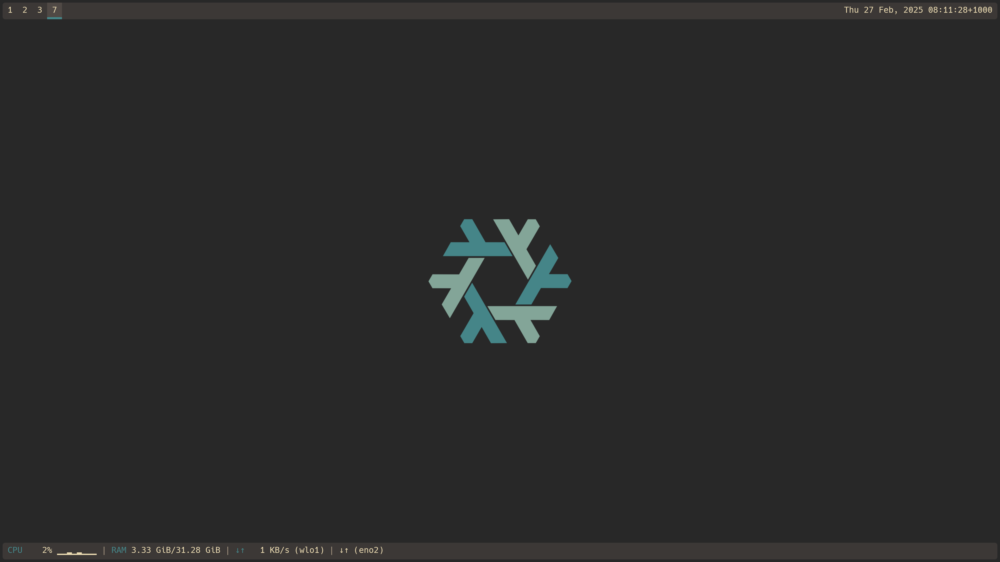

<div id="toc" style="white-space: normal;"><!-- generated --></div>

## Blog

*ongoing*

Posts:

* [Troubleshooting LightDM's test mode](https://blog.ielliott.io/troubleshooting-lightdms-test-mode)
* [Per-project Nix substituters](https://blog.ielliott.io/per-project-nix-substituters)
* [Sized types and coinduction in Safe Adga](https://blog.ielliott.io/sized-types-and-coinduction-in-safe-agda)
* [Unfettering the imagination](https://blog.ielliott.io/unfettering-the-imagination)

My [Hakyll setup](https://github.com/LightAndLight/lightandlight.github.io) now has documentation.
Someone asked my permission use my blog as a template, which I gave.
I added documentation so that they (and whoever else) can use all the features.

## Self-hosted GitHub CI runners

*January*

<https://github.com/LightAndLight/github-runner> (private)

I started playing around with self-hosting a GitHub CI runners on [DigitalOcean](https://www.digitalocean.com/) for use in [Ipso](https://ipso.dev).
The repo is private because I committed secrets, some encrypted and unencrypted, while I figured out how I wanted to do secret management.
It uses [SOPS](https://github.com/getsops/sops) with [age](https://github.com/FiloSottile/age) for secrets,
[Terraform](https://www.terraform.io/) for provisioning infrastructure,
and [NixOS](https://nixos.org/) for machine configurations.

## `citools`

*January*

<https://github.com/LightAndLight/citools>

Nix derivations and [Ipso](https://ipso.dev) scripts that I want to reuse outside of [Self-hosted GitHub CI runners](#self-hosted-github-ci-runners).

## Using linear algebra for quantitative queries

*January*

<https://github.com/LightAndLight/misc/tree/main/20240112-linear-algebra-queries>

Linear algebra on semirings sort-of generalises relational algebra.
This is a little bit of Agda code where I played around with the idea.
See the README for an overview.

Related reading:

* [A linear algebra approach to OLAP](https://repositorio.inesctec.pt/server/api/core/bitstreams/a533c8a1-0d69-4517-87e9-060503d3dc48/content)
* [Towards a linear algebra semantics for SQL](https://www.di.uminho.pt/~jno/ps/infoblender16sl.pdf)
* [Fun with Semirings](https://web.archive.org/web/20160305153614id_/http://www.cl.cam.ac.uk/~sd601/papers/semirings.pdf)

## Travel planning web app

*February&mdash;March*

<https://gitlab.com/LightAndLight/ix-travel> (private)

I wanted to collaborate on software with my partner, who's interested in the UX design and product management side of things.
She suggested we create a web app for travel planning.
We don't have much beyond signup, login, and deployment, because I got distracted by creating my own frameworks (see [`basque`](#basque), [Functional web routing](#functional-web-routing), [`hedge`](#hedge)).
It was fun to work together and I look forward to resuming it at some point.

## Nix Flakes for NixOS configurations

*March*

<https://github.com/LightAndLight/personal-configs>

I use NixOS and [`home-manager`](https://nix-community.github.io/home-manager/index.xhtml#ch-introduction) to manage configuration across all my computers.
The [NixOS & Flakes Book](https://nixos-and-flakes.thiscute.world/) showed me how to manage my entire system configuration, including my `home-manager` configs, with Flakes.

The main advantage of this approach is Flakes' external dependency management.
Rather than having
[`fetchTarball`](https://nix.dev/manual/nix/2.18/language/builtins.html?highlight=fetchtarball#builtins-fetchTarball)s
littered everywhere, all my dependencies are listed in a
[single place](https://github.com/LightAndLight/personal-configs/blob/547a8a4c3864c6318601111896a4f1a6ee101089/flake.nix#L1-L37),
and can be updated with a
[single command](https://nix.dev/manual/nix/2.24/command-ref/new-cli/nix3-flake-update.html).

## `basque`

*March*

<https://github.com/LightAndLight/basque> (private)

`basque` is a Haskell database library, inspired by [`beam`](https://haskell-beam.github.io/beam/)'s shortcomings.
I love the core premise of `beam`&mdash;a table is defined as a Haskell record&mdash;but I don't like the library's complexity, poor error messages, and SQL generation gotchas.
[`rel8`](https://hackage.haskell.org/package/rel8) also tackles these issues, but I haven't tried it yet.

One fun feature of `basque` is auto-migration, which was inspired by [`beam-automigrate`](https://hackage.haskell.org/package/beam-automigrate).
Auto-migration diffs the actual schema against the expected schema, and executes a series of schema changes to bring the actual schema up-to-date.
This is really nice for local iteration, but it can be finnicky in production.
I'm still figuring out how to think about auto-migration and whether/how it should be combined with traditional database migrations. 

`basque` is private because it's incomplete and it overlaps with some code in [`hedge`](#hedge).
`hedge` attempts to improve on [`basque`](#basque)'s database migrations.
It has auto-migration for local development, static migrations for production, and a tool that generates static migrations based on your code changes.

## `opstools`

*March*

<https://github.com/LightAndLight/opstools>

Tools that I created while working on [Travel planning web app](#travel-planning-web-app), that I think are broadly useful:

* `sshgen` - Simplified interface to ssh-keygen for stdin/stdout-based SSH key generation.
* `tmply` - Pass temporary data to a process and clean up after.
* `retry` - Retry a failing command.

## Improved `cd` command

*March*

<https://github.com/LightAndLight/personal-configs/blob/547a8a4c3864c6318601111896a4f1a6ee101089/home/fish.nix#L18-L30>

I almost always run `ls` after `cd` to get an overview of the new directory's contents.
For large directories, the `ls` output takes up too much screen space.
I overrode Fish's `cd` command to list the first 20 items after I `cd`.
If there are no more than 20 items, this looks like normal `ls` output.
But if there are more than 20 items, the final line says `(20 of X items shown)`.

The `ls` output is truncated using `head`: `ls | head -n 20`.
This creates a new problem; it removes the column formatting that `ls` produces when you call it from a terminal.
I tried using the [`column`](https://www.man7.org/linux/man-pages/man1/column.1.html) program, but it didn't support terminal escape sequences.
It counted the escape sequences as visible characters, which threw off the column calculations.
This seemed like a simple kind of program, so I wrote my own: [`columnize`](https://github.com/LightAndLight/columnize).

## `git-format-staged`

*March*

* <https://github.com/LightAndLight/git-format-staged>
* <https://github.com/LightAndLight/git-ustash> (precursor to `git-format-staged`)

Modify staged files, backporting changes onto their unstaged versions. Useful for formatting files as part of a [pre-commit hook](https://git-scm.com/book/en/v2/Customizing-Git-Git-Hooks).

This is something I've wanted when writing [pre-commit hooks](https://git-scm.com/book/en/v2/Customizing-Git-Git-Hooks) that do auto-formatting.
The goal of a pre-commit auto-formatter is to format staged files without affecting any other files.
`git diff --cached --name-only` gives the list of staged files, but if you *just* format them without any other preparation then you can cause issues with unstaged files.
For example, if you use `git add -p` to stage a file using a partial patch, then you will have the rest of the file unstaged.
How to format just the staged copy of the file?
The unstaged version (with the remainder of the changes) is the only one on disk.
Using `git stash --keep-index` almost does the right thing; it gets the unstaged files out of the way so it looks like you are free to work on just the staged files.
Unfortunately it also stashes the staged files, so that when you auto-format the staged files, re-add them to the index, and pop from the stash, the formatted files are overwritten by the stash.
[This answer on StackOverflow](https://stackoverflow.com/a/71222518/2884502) looked promising, but `git stash push --staged` fails with an error when I use it in the `git add -p` aforementioned situation.

## Git CLI overhaul

*April*

<https://github.com/LightAndLight/personal-configs/blob/547a8a4c3864c6318601111896a4f1a6ee101089/home/git.nix#L26-L403>

I used Nix (via `home-manager`) to set up dozens of [Git aliases](https://git-scm.com/book/en/v2/Git-Basics-Git-Aliases), essentially creating my own alternative Git CLI.
Read the detailed listing (with demo videos) [here](/my-git-cli-overhaul).

## Haskell build tool experiments

*April*

<https://github.com/LightAndLight/hbuild> (private)

I experimented with building Haskell packages from scratch, without [Cabal](https://www.haskell.org/cabal/) (or [Stack](https://haskellstack.org)).
I started by writing a Makefile that can build an example Haskell library and executable.
It directly uses the [GHC package database](https://downloads.haskell.org/ghc/latest/docs/users_guide/packages.html) for dependencies
and generates a package database entry for the library.
After that I wrote a build tool that reads a [TOML](https://toml.io) manifest and uses [Shake](https://shakebuild.com) for incremental rebuilds.
The next step would be to download dependencies from Hackage.

This code is private because experimenting with alternative Haskell build tools seems like a sensitive topic.
I remember a bunch of Cabal/Stack drama from ~10 years ago and don't want to repeat it.
That said, I think Cabal is not a great build tool, and I want to see if I can do better.
My main focuses are user experience, performance, and implementation simplicity.
If I create something that I'm willing to use, and it feels good and is well written, then I'll make it public.
Then I'll use it as an exemplar to motivate improvements to Cabal.
For projects as large and old as Cabal, I feel like it's better to demonstrate what things should be like with a prototype instead of arguing over hypothetical improvements.

## Beginner OS dev

*June*

<https://github.com/LightAndLight/learn-os>

I started learning about OS development from first principles.
So far I have a barebones UEFI program that loads a kernel which prints `hello from kernel!` to a serial device.

I remember being fascinated by [virtual memory](https://en.wikipedia.org/wiki/Virtual_memory),
the [page table](https://en.wikipedia.org/wiki/Page_table),
and how the kernel manages it all.
Since CPU instructions are also read from memory, they're also subject to address translation.
This means kernel code that changes the page table could accidentally alter its own control flow.
In order for the kernel to continue normally after changing the page table,
the region of code responsible for switching needs to live at the same virtual addresses in the old and new page tables.

I also got [a small pull request](https://github.com/rust-osdev/uefi-rs/pull/1187) merged into [`uefi-rs`](https://github.com/rust-osdev/uefi-rs).
I want to do more of these small fixes for open source libraries, because it feels like if we all do this sort of thing then we'll end up with very high quality software.

## Functional web routing

*July*

<https://github.com/LightAndLight/misc/tree/main/20240704-functional-web-routing>

This started out as an attempt to do trie-based URL routing on well-typed web route specifications,
and grew into a [Servant](https://servant.dev)-like web framework,
but with a much smaller type-level DSL.
I quite like it, and I've been expanding on it in another project, [`hedge`](#hedge).

## Desktop environment theming

*August*

* <https://github.com/LightAndLight/personal-configs/blob/cdb00b793006e72768b2f6a6b8d0622ab7cd4c33/home/taffybar/taffybar.css>
* <https://github.com/LightAndLight/personal-configs/blob/cdb00b793006e72768b2f6a6b8d0622ab7cd4c33/home/xsession/xmonad.hs#L29>
* <https://github.com/LightAndLight/personal-configs/blob/cdb00b793006e72768b2f6a6b8d0622ab7cd4c33/home/xsession/default.nix#L14-L23>

I set up a consistent colour scheme (based on [Gruvbox](https://github.com/morhetz/gruvbox)) across
[Xmonad](https://xmonad.org/),
[Taffybar](https://github.com/taffybar/taffybar),
and
[dmenu](https://tools.suckless.org/dmenu/).
I used [picom](https://github.com/yshui/picom) to add rounded corners to my X windows.
See [Replace Taffybar with Polybar](#replace-taffybar-with-polybar) for a screenshot; I did more customisation later in the year.

## Safe sized types and coinduction in Agda

*August*

* <https://github.com/LightAndLight/agda-safe-sized-types>
* <https://blog.ielliott.io/sized-types-and-coinduction-in-safe-agda>

Coinduction is important for total languages like Agda because can be used to write and reason about continuing (essentially non-terminating) processes.
A few of the official coinductive methods in Agda are unsound, but I think I found an approach that implements coinduction using sound extensions.

The practical motivation for all of this is writing parser combinators in Agda.
The naive (i.e. "just port it from Haskell") approach doesn't work due to Agda's restrictive termination checker.
Coinduction plus a slightly safer set of combinators makes everything work.

## `xeval`

*September*

<https://github.com/LightAndLight/xeval>

`xeval` is a program that reads the X11 selection, evaluates it if it's an arithmetic expression, and replaces the selection with the result.
I bound it to `mod+e` in my XMonad config.
I've noticed that it doesn't work very well because different programs have slightly different ways of managing the X11 selection.
Testing it with one kind of text input (e.g. the Firefox URL bar) doesn't guarantee that it works with another kind of text input
(e.g. the Chromium URL bar).

## Haskell code manipulation via `ghc-exactprint`

*October*

<https://github.com/LightAndLight/misc/tree/main/20241019-ghc-exactprint>

This was an attempt to use [GHC API](https://hackage.haskell.org/package/ghc) and [`ghc-exactprint`](https://hackage.haskell.org/package/ghc-exactprint) for formatting-preserving syntax tranformations.
I've applying what I've learned to to [Rails-style boilerplate generation](https://guides.rubyonrails.org/command_line.html#bin-rails-generate) for a Haskell web framework (see [`hedge`](#hedge)).

`rails generate controller CONTROLLER ACTION*` creates a new controller by generating some files from templates,
and it registers the actions' routes by adding some lines to an existing Ruby file (`routes.rb`).
This piqued my interest because it's not just adding those lines to the end of a file; it's somewhat syntax-aware.

It's [a little more finnicky](https://stackoverflow.com/a/39742150/2884502) to add an action to an existing controller via the CLI.
I think most people just write the code.
I want a workflow in Haskell where there are a few conventional modules that a CLI tool can programmatically update to add a new endpoint.

The practise program I wrote can add fields to a record while preserving formatting:

<table>
<thead>
<th>Input</th>
<th>Action</th>
<th>Output</th>
</thead>
<tbody>
<tr>
<td>

```haskell
data X = X { a :: Int, b :: Int }
```

</td>
<td>

add `c :: Int`

</td>
<td>

```haskell
data X = X { a :: Int, b :: Int, c :: Int }
```

</td>
</tr>
<tr>
<td>

```haskell
data X
  = X
  { a :: Int
  , b :: Int 
  }
```

</td>
<td>

add `c :: Int`

</td>
<td>

```haskell
data X
  = X
  { a :: Int
  , b :: Int
  , c :: Int
  }
```

</td>
</tr>
<tr>
<td>


```haskell
data X =
  X{
    a :: Int,
    b :: Int
  }
```

</td>
<td>

add `c :: Int`

</td>
<td>

```haskell
data X =
  X{
    a :: Int,
    b :: Int,
    c :: Int
  }
```

</td>
</tr>
</tbody>
</table>

## `haskell-syntax-tools`

*October*

<https://github.com/LightAndLight/haskell-syntax-tools>

After [Haskell code manipulation via `ghc-exactprint`](#haskell-code-manipulation-via-ghc-exactprint),
I created some support libraries to help me write scaffolding and boilerplate generation for [`hedge`](#hedge).
I initially tried to use [`ghc-exactprint`](https://hackage.haskell.org/package/ghc-exactprint),
but I found its documentation was lacking and its API wasn't intuitive.
It was easier to start from scratch.

`haskell-syntax-tools` includes:
[optics for the GHC AST](https://github.com/LightAndLight/haskell-syntax-tools/blob/2981581fbddc6011f41558ae693e21e1ec556509/ghc-lens/src/GHC/Lens.hs),
[common syntax manipulations](https://github.com/LightAndLight/haskell-syntax-tools/blob/2981581fbddc6011f41558ae693e21e1ec556509/ghc-exactprint-transform/src/GHC/ExactPrint/Transform.hs),
and [a quasiquoter for writing GHC AST fragments](https://github.com/LightAndLight/haskell-syntax-tools/blob/2981581fbddc6011f41558ae693e21e1ec556509/ghc-exactprint-syntax/src/GHC/ExactPrint/QQ.hs).

## `template-monoid`

*October*

<https://github.com/LightAndLight/template-monoid>

`template-monoid` is a simple Haskell library for combining monoidal values with effects.
Quoting the README:

> The `Template` type defined in this library already exists in `base` as [`Ap`](https://hackage.haskell.org/package/base-4.12.0.0/docs/Data-Monoid.html#t:Ap).
> I've created a new package because I think it deserves to stand on its own as a concept, with explanations and code examples.
>
> The description of the `Ap` type is:
>
> > This data type witnesses the lifting of a Monoid into an Applicative pointwise.
>
> While accurate, this description is rather dry and doesn't spark my curiosity or gesture at potential uses for this datatype.

`Template` has an `IsString` instance, so you can write code like `("Hello, " <> Template readLine) :: Template IO String`.
I've used it to generate SQL queries in [`basque`](#basque) and [`hedge`](#hedge).
SQL queries are mostly strings, but if you want to escape identifiers then the strings have to live in `ReaderT Connection IO`.
`Template` makes this quite pretty, e.g. `("SELECT * FROM " <> escape tableName <> " WHERE id = 1") :: Template (ReaderT Connection IO) String`.

## `hedge`

*October&mdash;November*

<https://github.com/LightAndLight/hedge> (private)

`hedge` is my attempt at a web framework that combines my favourite parts of
[Ruby on Rails](https://rubyonrails.org/) with my favourite parts of
[Haskell](https://www.haskell.org/) and functional programming.
My taste for web frameworks has become more refined,
and I want a framework that has all of my favourite features of various frameworks with none of the incidental downsides.

For example:

* I like Rails' "convention over configuration", "everything is Ruby", and use of scaffolding tools, but I dislike Ruby's type system.
* I like [Servant](https://www.servant.dev/)'s type safety, but dislike its implementation complexity.
* I like [Yesod](https://www.yesodweb.com/)'s boilerplate generation, but dislike its use of Template Haskell DSLs for this.
* I like [IHP](https://ihp.digitallyinduced.com/)'s comprehensiveness and focus on developer experience, but disagree with a lot of its software engineering choices.

`hedge` is an expression of some of my software engineering and web development values,
and it will probably live in a new corner of the design space when it comes to Haskell web frameworks.
It's currently private because I don't like having half-finished public repositories.
I'll open source it when I think it's usable.

## Replace Taffybar with Polybar

*December*

I got a new laptop and started playing with battery usage optimisation.
I soon noticed that Taffybar consistently used 100% of a CPU core while idle.
After a bit of searching I couldn't find anything that suggested improvements, so I started looking for alternatives.
I found [polybar](https://github.com/polybar/polybar), and [tried it out](https://github.com/LightAndLight/personal-configs/commit/009d2b68332725421aa16b5c00bcc4fbef185565).
It works great.
Here's my current config: <https://github.com/LightAndLight/personal-configs/blob/3e340b4d93359386bdda492cb72dfcc8b0922e17/home/polybar/config.ini.nix>.

<figure>

<figcaption>

Screenshot of my desktop.
There are two Polybar bars; one at the top of the screen and one at the bottom.
The top bar shows my X workspace selection, and the current date and time.
The bottom bar shows my computer's resource usage: CPU, RAM, and network traffic.
</figcaption>
</figure>

## `neuron` performance improvements

*December*

<https://github.com/LightAndLight/neuron>

[`neuron`](https://github.com/srid/neuron) is a simple [Zettelkasten](https://en.wikipedia.org/wiki/Zettelkasten) tool 
that I've been using for a couple of years.
It's no longer maintained, but it has worked fine for me for a long time.
Recently it started getting really slow, and I decided to investigate.

I eventually figured out that it was traversing the entirety of [`.direnv`](https://direnv.net/),
which contained a checkout of [`nixpkgs`](https://github.com/nixos/nixpkgs)
&mdash;a repo consisting of hundreds of thousands of files.
The code created a full file tree in memory then filtered out entries such as hidden directories.
I fixed it by applying the filepath filters while constructing the in-memory file tree,
so that it would skip `.direnv` and never even look at its contents.

I read a similar story recently:
[Why Modern Software is Slow–Windows Voice Recorder](https://randomascii.wordpress.com/2022/09/29/why-modern-software-is-slow-windows-voice-recorder/).
