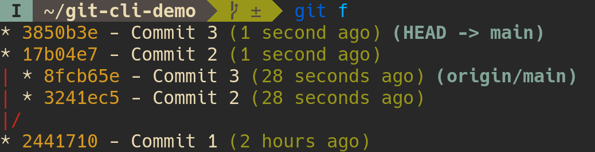
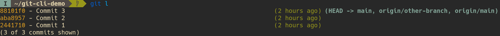
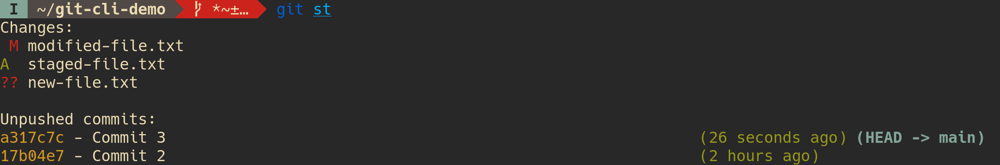

<!-- generated -->

## Blog

*ongoing*

Posts:

* [Troubleshooting LightDM's test mode](https://blog.ielliott.io/troubleshooting-lightdms-test-mode)
* [Per-project Nix substituters](https://blog.ielliott.io/per-project-nix-substituters)
* [Sized types and coinduction in Safe Adga](https://blog.ielliott.io/sized-types-and-coinduction-in-safe-agda)
* [Unfettering the imagination](https://blog.ielliott.io/unfettering-the-imagination)

My [Hakyll setup](https://github.com/LightAndLight/lightandlight.github.io) now has documentation.
Someone asked my permission use my blog as a template, which I gave.
I added documentation so that they (and whoever else) can use all the features.

## Nix Flakes for NixOS configurations

*March*

<https://github.com/LightAndLight/personal-configs>

I use NixOS on all my personal computers and used to personalise them with [`home-manager`](https://nix-community.github.io/home-manager/index.xhtml#ch-introduction).
The [NixOS & Flakes Book](https://nixos-and-flakes.thiscute.world/) showed me how to manage my entire system configuration, including my `home-manager` configs, with Flakes.

The main advantage of this approach is Flakes' external dependency management.
Rather than having
[`fetchTarball`](https://nix.dev/manual/nix/2.18/language/builtins.html?highlight=fetchtarball#builtins-fetchTarball)s
littered everywhere, all my dependencies are listed in a
[single place](https://github.com/LightAndLight/personal-configs/blob/547a8a4c3864c6318601111896a4f1a6ee101089/flake.nix#L1-L37),
and can be updated with a
[single command](https://nix.dev/manual/nix/2.24/command-ref/new-cli/nix3-flake-update.html).

## Git CLI overhaul

*April*

<https://github.com/LightAndLight/personal-configs/blob/547a8a4c3864c6318601111896a4f1a6ee101089/home/git.nix#L26-L403>

I used Nix (via `home-manager`) to set up dozens [Git aliases](https://git-scm.com/book/en/v2/Git-Basics-Git-Aliases), essentially creating my own alternative Git CLI.

Here's an overview:

* Meta: every command that changes the repo state prints the updated state using [`git st`](#git-st).

* Meta: every command that acts on a Git object, like a commit or a branch, opens a fuzzy finder if the object is omitted.

* <a id="git-a" href="#git-a">`git a FILE+`</a> - Stage the given `FILE`s. Inverse: [`git r`](#git-r).

* <a id="git-amend" href="#git-amend">`git amend`</a> - Add the currently staged changes to a given commit.

  <figure>
  <x-asciinema-cast data-src="./images/git-amend.cast" data-idle-time-limit="1" aria-details="git-amend-desc"></x-asciinema-cast>  
  
  <figcaption id="git-amend-details">
  
  [Asciinema](https://asciinema.org/) cast of `git amend` ([source](./images/git-amend.cast)).
  After a file is staged, `git amend` brings up a fuzzy-finder showing recent commits.
  A commit is selected, and the staged change inserted into that commit.
  
  <noscript>Enable JavaScript to view the cast.</noscript>
  </figcaption>
  </figure>

* <a id="git-ap" href="#git-ap">`git ap`</a> - Stage files using [interactive patch mode](https://git-scm.com/docs/git-add#_interactive_mode).

* <a id="git-au" href="#git-au">`git au`</a> - Stage all modified files.

* <a id="git-br" href="#git-br">`git br OPTION*`</a> - Branch management. Prints the current branch name if `OPTION`s are ommitted. Otherwise, `OPTION`s are passed to [`git branch`](https://git-scm.com/docs/git-branch).

* <a id="git-co" href="#git-co">`git co`</a> - Commit staged files, opening an editor for the commit message. Inverse: [`git undo`](#git-undo).

* <a id="git-coe" href="#git-coe">`git coe MESSAGE`</a> - Create an empty commit with message `MESSAGE`. Inverse: [`git undo`](#git-undo).

* <a id="git-com" href="#git-com">`git com MESSAGE`</a> - Commit staged files with message `MESSAGE`. Inverse: [`git undo`](#git-undo).

* `git ch BRANCH?` - Switch to a branch.

  <figure>
  <x-asciinema-cast data-src="./images/git-ch.cast" data-idle-time-limit="1" aria-details="git-ch-desc"></x-asciinema-cast>  
  
  <figcaption id="git-ch-details">
  
  [Asciinema](https://asciinema.org/) cast of `git ch` ([source](./images/git-ch.cast)).
  `git ch` brings up a fuzzy-finder showing available branches.
  A branch is selected and switched to.
  
  <noscript>Enable JavaScript to view the cast.</noscript>
  </figcaption>
  </figure>

* <a id="git-chn" href="#git-chn">`git chn BRANCH`</a> - Create and switch to a new branch.

* <a id="git-d" href="#git-d">`git d`</a> - Diff unstaged files against staged &amp; committed files.

* <a id="git-ds" href="#git-ds">`git ds`</a> - Diff staged files against committed files.

* <a id="git-f" href="#git-f">`git f`</a> - Fetch new changes, and show whether recent commits have diverged.
  
  <figure>
  </img>  
  
  <figcaption id="git-f-details">
  
  Screenshot of `git f`, where the local changes have diverged from the remote changes.
  The commits are listed in the same format as [`git l`](#git-l), but both the local and remote commits are listed, and an ASCII graph highlights the divergence.
  </figcaption>
  </figure>

* <a id="git-l" href="#git-l">`git l`</a> - Display the 20 most recent commits.
  
  <figure>
  </img>  
  
  <figcaption id="git-l-details">
  
  Screenshot of `git l`.
  Commits are listed one per line.
  Each line includes: a shortened commit hash, the first line of the commit message, the time since the commit was made, and any branches that point to the commit.  
  </figcaption>
  </figure>

* <a id="git-lg" href="#git-lg">`git lg`</a> - Display the 20 most recent commits using an ASCII graph.

  See [`git f`](#git-f) for a screenshot of an ASCII graph.

* <a id="git-p" href="#git-p">`git p`</a> - Push the current branch.

* <a id="git-pa" href="#git-pa">`git pa`</a> - Push all branches.

* <a id="git-pf" href="#git-pf">`git pf`</a> - Force-push the current branch.

* <a id="git-r" href="#git-r">`git r FILE+`</a> - Unstage staged `FILE`s.

* <a id="git-re" href="#git-re">`git re OPTION*`</a> - Call [`git rebase`](https://git-scm.com/docs/git-rebase) with `OPTION`s.

* <a id="git-rec" href="#git-rec">`git rec`</a> - `git rebase --continue`

* <a id="git-rei" href="#git-rei">`git rei COMMIT?`</a> - Start an [interactive rebase](https://git-scm.com/docs/git-rebase#_interactive_mode).
  Uses `COMMIT` as the base commit if provided.
  Otherwise, launches a fuzzy finder to select the base commit.

* <a id="git-reword" href="#git-reword">`git reword COMMIT?`</a> - Edit a commit message.
  Edits `COMMIT` if provided.
  Otherwise, launches a fuzzy finder to select the commit.

  <figure>
  <x-asciinema-cast data-src="./images/git-reword.cast" data-idle-time-limit="1" aria-details="git-reword-desc"></x-asciinema-cast>  
  
  <figcaption id="git-reword-details">
  
  [Asciinema](https://asciinema.org/) cast of `git reword` ([source](./images/git-reword.cast)).
  `git reword` brings up a fuzzy-finder showing recent commits.
  A commit is selected, and an editor opens containing that commit's message.
  The message is edited, the editor saved then closed, updating the commit's message.
  
  <noscript>Enable JavaScript to view the cast.</noscript>
  </figcaption>
  </figure>

* <a id="git-st" href="#git-st">`git st`</a> - Print the repo's state.

  <figure>
  </img>  
    
  <figcaption id="git-st-details">
  
  Screenshot of `git st`.
  Modified files are marked with a red "M", staged files are marked with a green "A", and new files are marked witha a red "??".
  The command also lists any unpushed commits.
  </figcaption>
  </figure>

* <a id="git-spop" href="#git-spop">`git spop`</a> - `git stash pop`

* <a id="git-spush" href="#git-spush">`git spush`</a> - `git stash push`

* <a id="git-undo" href="#git-undo">`git undo`</a> - Remove the most recent commit, staging its files. Inverse of [`git co`](#git-co), [`git coe`](#git-coe), [`git com`](#git-com).

## Improved `cd` command

*March*

<https://github.com/LightAndLight/personal-configs/blob/547a8a4c3864c6318601111896a4f1a6ee101089/home/fish.nix#L18-L30>

I almost always run `ls` after `cd` to get an overview of the new directory's contents.
For large directories, the `ls` output takes up too much screen space.
I overrode Fish's `cd` command to list the first 20 items after I `cd`.
If there are no more than 20 items, this looks like normal `ls` output.
But if there are more than 20 items, the final line says `(20 of X items shown)`.

The `ls` output is truncated using `head`: `ls | head -n 20`.
This creates a new problem; it removes the column formatting that `ls` produces when you call it from a terminal.
I tried using the [`column`](https://www.man7.org/linux/man-pages/man1/column.1.html) program, but it didn't support terminal escape sequences.
It counted the escape sequences as visible characters, which threw off the column calculations.

This seemed like a simple kind of program, so I wrote my own: [`columnize`](https://github.com/LightAndLight/columnize).

## Desktop environment theming

*August*

* <https://github.com/LightAndLight/personal-configs/blob/cdb00b793006e72768b2f6a6b8d0622ab7cd4c33/home/taffybar/taffybar.css>
* <https://github.com/LightAndLight/personal-configs/blob/cdb00b793006e72768b2f6a6b8d0622ab7cd4c33/home/xsession/xmonad.hs#L29>
* <https://github.com/LightAndLight/personal-configs/blob/cdb00b793006e72768b2f6a6b8d0622ab7cd4c33/home/xsession/default.nix#L14-L23>

I set up a consistent colour scheme (based on [Gruvbox]()) across
[Xmonad](https://xmonad.org/),
[Taffybar](https://github.com/taffybar/taffybar),
and
[dmenu](https://tools.suckless.org/dmenu/).
I used [picom](https://github.com/yshui/picom) to add rounded corners to my X windows.
See XXX for a screenshot, because I did more customisation later in the year.

## Replace Taffybar with Polybar

*December*

I got a new laptop and started playing with battery usage optimisation.
I noticed that Taffybar consistently used 100% of a CPU core while idle.
After a bit of searching I couldn't find anything that suggested improvements, so I started looking for alternatives.
I found [polybar](https://github.com/polybar/polybar)
