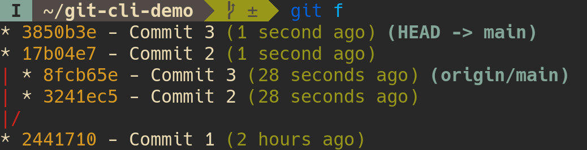
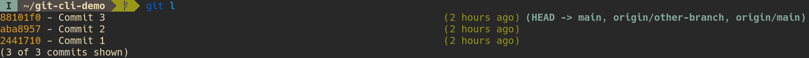
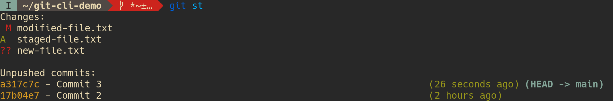

*I split this out of [my 2024 project review](/2024-project-review) because it got too long.*

Last year I improved my daily Git experience by writing a bunch of aliases.
Here's a reference for what I've done so far ([Nix configs](https://github.com/LightAndLight/personal-configs/blob/3e340b4d93359386bdda492cb72dfcc8b0922e17/home/git.nix#L26)).

<!-- generated -->

## Meta

* Every command that changes repo state prints the updated state using [`git st`](#git-st).

* Every command that acts on a Git object, like a commit or a branch, opens a fuzzy finder if the object is omitted.

## `git a`

`git a FILE+` - Stage the given `FILE`s.

Inverse: [`git r`](#git-r).

## `git amend`
  
`git amend` - Add the currently staged changes to a given commit.

<figure>
<x-asciinema-cast data-src="./images/git-amend.cast" data-idle-time-limit="1" aria-details="git-amend-details"></x-asciinema-cast>
<figcaption id="git-amend-details">
  
[Asciinema](https://asciinema.org/) cast of `git amend` ([source](./images/git-amend.cast)).
After a file is staged, `git amend` brings up a fuzzy-finder showing recent commits.
A commit is selected, and the staged change inserted into that commit.
  
<noscript>Enable JavaScript to view the cast.</noscript>
</figcaption>
</figure>

## `git ap`

`git ap` - Stage files using [interactive patch mode](https://git-scm.com/docs/git-add#_interactive_mode).

## `git au`

`git au` - Stage all modified files.

## `git br`

`git br OPTION*` - Branch management.

Prints the current branch name if `OPTION`s are ommitted. Otherwise, `OPTION`s are passed to [`git branch`](https://git-scm.com/docs/git-branch).

## `git co`

`git co` - Commit staged files, opening an editor for the commit message.

Inverse: [`git undo`](#git-undo).

## `git coe`

`git coe MESSAGE` - Create an empty commit with message `MESSAGE`.

Inverse: [`git undo`](#git-undo).

## `git com`

`git com MESSAGE` - Commit staged files with message `MESSAGE`.

Inverse: [`git undo`](#git-undo).

## `git ch`

`git ch BRANCH?` - Switch to a branch.

<figure>
<x-asciinema-cast data-src="./images/git-ch.cast" data-idle-time-limit="1" aria-details="git-ch-details"></x-asciinema-cast>
<figcaption id="git-ch-details">
  
[Asciinema](https://asciinema.org/) cast of `git ch` ([source](./images/git-ch.cast)).
`git ch` brings up a fuzzy-finder showing available branches.
A branch is selected and switched to.
  
<noscript>Enable JavaScript to view the cast.</noscript>
</figcaption>
</figure>

## `git chn`

`git chn BRANCH` - Create and switch to branch `BRANCH`.

## `git d`

`git d` - Diff unstaged files against staged and committed files.

## `git ds`

`git ds` - Diff staged files against committed files.

## `git f`

`git f` - Fetch new changes, and show whether recent commits have diverged.
  
<figure>

<figcaption id="git-f-details">
  
Screenshot of `git f`, where the local changes have diverged from the remote changes.
The commits are listed in the same format as [`git l`](#git-l), but both the local and remote commits are listed, and an ASCII graph highlights the divergence.
</figcaption>
</figure>

## `git l`

`git l` - Display the 20 most recent commits.
  
<figure>

<figcaption id="git-l-details">

Screenshot of `git l`.
Commits are listed one per line.
Each line includes: a shortened commit hash, the first line of the commit message, the time since the commit was made, and any branches that point to the commit.  
</figcaption>
</figure>

## `git lg`

`git lg` - Display the 20 most recent commits using an ASCII graph.

See [`git f`](#git-f) for a screenshot of an ASCII graph.

## `git p`

`git p` - Push the current branch.

## `git pa`

`git pa` - Push all branches.

## `git pf`

`git pf` - Force-push the current branch.

## `git r`

`git r FILE+` - Unstage staged `FILE`s.

## `git re`

`git re OPTION*` - Call [`git rebase`](https://git-scm.com/docs/git-rebase) with `OPTION`s.

## `git rec`

`git rec` - Alias for `git rebase --continue`.

## `git rei`

`git rei COMMIT?` - Start an [interactive rebase](https://git-scm.com/docs/git-rebase#_interactive_mode).

Uses `COMMIT` as the base commit if provided.
Otherwise, launches a fuzzy finder to select the base commit.

## `git reword`

`git reword COMMIT?` - Edit a commit message.

Edits `COMMIT` if provided.
Otherwise, launches a fuzzy finder to select the commit.

<figure>
<x-asciinema-cast data-src="./images/git-reword.cast" data-idle-time-limit="1" aria-details="git-reword-details"></x-asciinema-cast>
<figcaption id="git-reword-details">

[Asciinema](https://asciinema.org/) cast of `git reword` ([source](./images/git-reword.cast)).
`git reword` brings up a fuzzy-finder showing recent commits.
A commit is selected, and an editor opens containing that commit's message.
The message is edited, the editor saved then closed, updating the commit's message.

<noscript>Enable JavaScript to view the cast.</noscript>
</figcaption>
</figure>

## `git st`

`git st` - Print the repo's state.

<figure>

<figcaption id="git-st-details">

Screenshot of `git st`.
Modified files are marked with a red "M", staged files are marked with a green "A", and new files are marked witha a red "??".
The command also lists any unpushed commits.
</figcaption>
</figure>

## `git spop`

`git spop` - Alias for `git stash pop`.

## `git spush`

`git spush` - Alias for `git stash push`.

## `git undo`

`git undo` - Remove the most recent commit, staging its files.

Inverse of [`git co`](#git-co), [`git coe`](#git-coe), [`git com`](#git-com).
