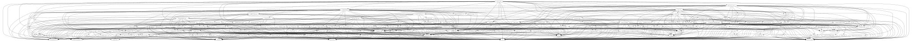

<!-- generated -->

I wanted to do some dependency analysis of a Haskell project,
and I wanted to see what it was like without installing a Cabal-specific tool such as
[`cabal-plan`](https://hackage.haskell.org/package/cabal-plan) (which works fine).
Here's what I played around with.

## Finding the GHC package database used by Cabal

When building Haskell code with GHC and Cabal,
Cabal manages [GHC package databases](https://ghc.gitlab.haskell.org/ghc/doc/users_guide/packages.html) for your project.
Cabal uses the [`GHC_ENVIRONMENT`](https://ghc.gitlab.haskell.org/ghc/doc/users_guide/packages.html#envvar-GHC_ENVIRONMENT) environment variable to communicate package information to GHC.

Inspect the variable via `cabal exec`:

<samp>$ <kbd>cabal exec &#x2D;&#x2D; printenv GHC_ENVIRONMENT</kbd></samp>

(output)

<pre><samp>/home/isaac/scotty/dist-newstyle/tmp/environment.-42133/.ghc.environment.x86_64-linux-9.6.6
</samp></pre>

It's a temporary file that's cleaned up after `cabal` exits:

<samp>$ <kbd>cat $(cabal exec &#x2D;&#x2D; printenv GHC_ENVIRONMENT)</kbd></samp>

(output)

<pre><samp>cat: /home/isaac/scotty/dist-newstyle/tmp/environment.-42668/.ghc.environment.x86_64-linux-9.6.6: No such file or directory
</samp></pre>

So to read the file's contents:

<samp>$ <kbd>cabal exec &#x2D;&#x2D; bash -c &apos;cat $(printenv GHC_ENVIRONMENT) | wc -l&apos;</kbd></samp>

(output)

<pre><samp>167
</samp></pre>

<samp>$ <kbd>cabal exec &#x2D;&#x2D; bash -c &apos;cat $(printenv GHC_ENVIRONMENT) | head -n 20&apos;</kbd></samp>

(output)

<pre><samp>&#x2D;&#x2D; This is a GHC environment file written by cabal. This means you can
&#x2D;&#x2D; run ghc or ghci and get the environment of the project as a whole.
&#x2D;&#x2D; But you still need to use cabal repl $target to get the environment
&#x2D;&#x2D; of specific components (libs, exes, tests etc) because each one can
&#x2D;&#x2D; have its own source dirs, cpp flags etc.
&#x2D;&#x2D;
clear-package-db
global-package-db
package-db /home/isaac/.local/state/cabal/store/ghc-9.6.6/package.db
package-db /home/isaac/scotty/dist-newstyle/packagedb/ghc-9.6.6
package-id scotty-0.22-inplace
package-id aeson-2.2.3.0-22b3a92d15c9e101394040ae41246b217864b9947aefa8650ea84ae86f886a71
package-id OneTuple-0.4.2-7fce57870ab38b77b68efd7d8a8c569b5646e38fd6083c48482d84b2cbb4b9f8
package-id base-4.18.2.1
package-id ghc-bignum-1.3
package-id ghc-prim-0.10.0
package-id rts-1.0.2
package-id template-haskell-2.20.0.0
package-id ghc-boot-th-9.6.6
package-id pretty-1.1.3.6
</samp></pre>

This means that `cabal build` et al. will use package databases `/home/isaac/.local/state/cabal/store/ghc-9.6.6/package.db` and `/home/isaac/scotty/dist-newstyle/packagedb/ghc-9.6.6`.

Now that we know the package database paths, we can use [`ghc-pkg`](https://ghc.gitlab.haskell.org/ghc/doc/users_guide/packages.html#package-management-the-ghc-pkg-command) to query them.

<samp>$ <kbd>ghc-pkg &#x2D;&#x2D;package-db=/home/isaac/.local/state/cabal/store/ghc-9.6.6/package.db list | wc -l</kbd></samp>

(output)

<pre><samp>675
</samp></pre>

I think this is just the package database for everything I've downloaded from Hackage to date.

What about the other one?

<samp>$ <kbd>ghc-pkg &#x2D;&#x2D;package-db=/home/isaac/scotty/dist-newstyle/packagedb/ghc-9.6.6 list</kbd></samp>

(output)

<pre><samp>WARNING: there are broken packages.  Run &apos;ghc-pkg-9.6.6 check&apos; for more details.
/home/isaac/scotty/dist-newstyle/packagedb/ghc-9.6.6
    scotty-0.22
</samp></pre>

<samp>$ <kbd>ghc-pkg &#x2D;&#x2D;package-db=/home/isaac/scotty/dist-newstyle/packagedb/ghc-9.6.6 check</kbd></samp>

(output)

<pre><samp>There are problems in package scotty-0.22:
  Warning: haddock-interfaces: /home/isaac/scotty/dist-newstyle/build/x86_64-linux/ghc-9.6.6/scotty-0.22/doc/html/scotty/scotty.haddock doesn&apos;t exist or isn&apos;t a file
  Warning: haddock-html: /home/isaac/scotty/dist-newstyle/build/x86_64-linux/ghc-9.6.6/scotty-0.22/doc/html/scotty doesn&apos;t exist or isn&apos;t a directory
  dependency "aeson-2.2.3.0-22b3a92d15c9e101394040ae41246b217864b9947aefa8650ea84ae86f886a71" doesn&apos;t exist
  dependency "blaze-builder-0.4.2.3-12eefb9a1a78be6e7022945ab259dd32e85b6ca455fcd003fe4e06f9179e7992" doesn&apos;t exist
  ...
  dependency "wai-extra-3.1.17-819af7b672ea64d23961a97b5fe6cf5ca65cb2c5510c7d77bbddee954acb10c5" doesn&apos;t exist
  dependency "warp-3.4.7-7055965423ff64562e3affc843bcceaf11f389a4a74c6cd55ed3940f63322e42" doesn&apos;t exist
Warning: include-dirs: /nix/store/97cajcan6faqj0kr9zhl0jin38vzcnhi-ghc-9.6.6/lib/ghc-9.6.6/lib/../lib/x86_64-linux-ghc-9.6.6/directory-1.3.8.5/include doesn&apos;t exist or isn&apos;t a directory

The following packages are broken, either because they have a problem
listed above, or because they depend on a broken package.
scotty-0.22
</samp></pre>

It's missing a bunch of dependencies. Let's use both package databases together:

<samp>$ <kbd>ghc-pkg &#x2D;&#x2D;package-db=/home/isaac/.local/state/cabal/store/ghc-9.6.6/package.db &#x2D;&#x2D;package-db=/home/isaac/scotty/dist-newstyle/packagedb/ghc-9.6.6 list</kbd></samp>

(output)

<pre><samp>/home/isaac/.local/state/cabal/store/ghc-9.6.6/package.db
    Cabal-3.12.1.0
    Cabal-syntax-3.12.1.0
    ChasingBottoms-1.3.1.15
    Glob-0.10.2
    HUnit-1.6.2.0
    JuicyPixels-3.3.9
    JuicyPixels-3.3.9
    MemoTrie-0.6.11
    OneTuple-0.4.2
    ...
    xml-types-0.3.8
    yaml-0.11.11.2
    yaml-0.11.11.2
    zip-archive-0.4.3.2
    zlib-0.7.1.0
    zlib-0.7.1.0

/home/isaac/scotty/dist-newstyle/packagedb/ghc-9.6.6
    scotty-0.22
</samp></pre>

The second package database is just for this project's packages.

## Package database analysis

Now that we've got a working package database stack, we can play around.
First, save the dependency graph in a flexible format:

<samp>$ <kbd>ghc-pkg &#x2D;&#x2D;package-db=/home/isaac/scotty/dist-newstyle/packagedb/ghc-9.6.6 &#x2D;&#x2D;simple-output field scotty-0.22 id</kbd></samp>

(output)

<pre><samp>scotty-0.22-inplace
</samp></pre>

<samp>$ <kbd>python3 - > scotty-0.22-inplace.json &lt;&lt;EOF</kbd></samp>

<pre><samp>$ <kbd>python3 - > scotty-0.22-inplace.json &lt;&lt;EOF
import json
import subprocess

package_name = "scotty-0.22-inplace"

def graph(package_id):
  result = {}

  def go(package_id):
    depends = subprocess.run(
      [
        "ghc-pkg",
        "&#x2D;&#x2D;no-user-package-db",
        "&#x2D;&#x2D;package-db=/home/isaac/.local/state/cabal/store/ghc-9.6.6/package.db",
        "&#x2D;&#x2D;package-db=/home/isaac/scotty/dist-newstyle/packagedb/ghc-9.6.6",
        "&#x2D;&#x2D;ipid",
        "&#x2D;&#x2D;simple-output",
        "field",
        package_id,
        "depends"
      ],
      capture_output=True,
      text=True
    ).stdout.strip()

    split_depends = [depend_id for depend_id in map(lambda x: x.strip(), depends.split(" ")) if depend_id]
  
    result[package_id] = split_depends
    for depend_id in split_depends:
      if depend_id not in result:
        go(depend_id)

  go(package_id)

  return result

print(json.dumps(graph(package_name), sort_keys=True))
EOF
</kbd></samp></pre>

(no output)

Then visualise the graph:

<samp>$ <kbd>{ python3 - | dot -Tsvg > scotty-0.22-inplace.svg; } &lt;&lt;EOF</kbd></samp>

<pre><samp>$ <kbd>{ python3 - | dot -Tsvg > scotty-0.22-inplace.svg; } &lt;&lt;EOF
import json

file_name = "scotty-0.22-inplace.json"

def quote(x):
  return f&apos;"{x}"&apos;

def strip_id(x):
  [*prefix, last] = x.split("-")
  return "-".join(prefix)

def dot(graph):
  for k, v in graph.items():
    joined_depends = "{" + " ".join([quote(strip_id(depend_id)) for depend_id in v]) + "}"    
    print(f"{quote(strip_id(k))} -> {joined_depends}")

print("digraph {")
with open(file_name) as file:
  dot(json.load(file))
print("}")
EOF
</kbd></samp></pre>

(no output)

<samp>$ <kbd>dot -Tsvg scotty-0.22-inplace.dot > deps-scotty-0.22-inplace.svg</kbd></samp>

(output)

<figure>

<figcaption>
Dependency graph for my checkout of [scotty-0.22](https://hackage.haskell.org/package/scotty-0.22)
</figcaption>
</figure>

</ul>

Let's order them by transitive closure size:

<samp>$ <kbd>{ python3 - | sort -h | tail; } &lt;&lt;EOF</kbd></samp>

<pre><samp>$ <kbd>{ python3 - | sort -h | tail; } &lt;&lt;EOF
import json

file_name = "scotty-0.22-inplace.json"

def transitive_closure(graph, root):
  seen = set()

  def go(node):
    if node in seen:
      return set()
    else:
      seen.add(node)
      return set.union({node}, *[go(adjacent_node) for adjacent_node in graph[node]])

  return go(root)

def transitive_closure_sizes(graph):
  for node in graph.keys():
    print(len(transitive_closure(graph, node)), node)

with open(file_name) as file:
  transitive_closure_sizes(json.load(file))
EOF
</kbd></samp></pre>

(output)

<pre><samp>25 streaming-commons-0.2.2.6-3f522fa5f939db1b55145657d311c943006edb86009c26092909366b2ee75aee
28 semigroupoids-6.0.1-9dd89e384571d44fb22e2fb7072578c66e77815638622ba98f23f5f4b84282b2
33 http-api-data-0.6.1-44cab653536eecb6e1a4492b7db5ddb55bad7134ef4df6f7019d9b0d933fbf23
33 wai-logger-2.5.0-afde5370b0becd5a59db9b87d40363205352d3d195d9f7f6918e6141c5790f9b
34 http2-5.3.9-e85f1b676925943caace1517467efd2cb267ded07cdb15141f4d23011f166d32
36 semialign-1.3.1-54b91e33817ae4935235d4a598fa09630b1344e5fc8ef634e7b379a9abcbae4b
58 aeson-2.2.3.0-22b3a92d15c9e101394040ae41246b217864b9947aefa8650ea84ae86f886a71
67 warp-3.4.7-7055965423ff64562e3affc843bcceaf11f389a4a74c6cd55ed3940f63322e42
117 wai-extra-3.1.17-819af7b672ea64d23961a97b5fe6cf5ca65cb2c5510c7d77bbddee954acb10c5
127 scotty-0.22-inplace
</samp></pre>

`wai-extra` sure has a lot of dependencies. Which dependencies are unique to `wai-extra`?

<samp>$ <kbd>{ python3 - | sort; } &lt;&lt;EOF</kbd></samp>

<pre><samp>$ <kbd>{ python3 - | sort; } &lt;&lt;EOF
import json

file_name = "scotty-0.22-inplace.json"

def transitive_closure(graph, root, excluding={}):
  def go(node, excluding):
      result = {node}
      for adjacent_node in graph[node]:
        if adjacent_node not in excluding:
          result = set.union(result, go(adjacent_node, {}))
      return result

  return go(root, excluding)

with open(file_name) as file:
  graph = json.load(file)

wai_extra = "wai-extra-3.1.17-819af7b672ea64d23961a97b5fe6cf5ca65cb2c5510c7d77bbddee954acb10c5"
a = transitive_closure(graph, "scotty-0.22-inplace", {wai_extra})
b = transitive_closure(graph, wai_extra)
for element in b - a:
  print(element)
EOF
</kbd></samp></pre>

(output)

<pre><samp>ansi-terminal-1.1.2-d813dc9a9ddcc8fe046981ae4cf16e97851f81b47627fe62d97deeea8b3a895c
ansi-terminal-types-1.1-f5259ee8039cb2e4f0745aaf2a221ac1804976d88721a0bbf03fa589fc1da7b9
base64-bytestring-1.2.1.0-1d3b0d9233998c8db4e03792dfcb571d3630c51818122c1df384f008255859d8
call-stack-0.4.0-8d31f8ae063fb95797e807de0dcca55432203fbdb07105abf4ba4f3a0860ef74
colour-2.3.6-24e30114cf117673f32f0197751def539bd8f5410de72a299de6885591f0fdfd
easy-file-0.2.5-30a028cc4c6fd7862bc8a47d31985a45218a10d4422c035a8fff3448ec4801dc
fast-logger-3.2.5-ba361b4be97b9b35499712d8f507906cdebc3cc5a1036133240c2e08b10a6a56
HUnit-1.6.2.0-df563d5b792be11ca4e58e4d870dddc83eb4e3f9a52334bc71194d682e05b20e
unix-compat-0.7.3-32201a092fc238f3eccb0914b80c185b8d1d4f773a1dd8f2fb5563b7b6d76bda
wai-extra-3.1.17-819af7b672ea64d23961a97b5fe6cf5ca65cb2c5510c7d77bbddee954acb10c5
wai-logger-2.5.0-afde5370b0becd5a59db9b87d40363205352d3d195d9f7f6918e6141c5790f9b
</samp></pre>

And if we exclude `wai-extra`, then which dependencies are unique to `aeson`?

<samp>$ <kbd>{ python3 - | sort; } &lt;&lt;EOF</kbd></samp>

<pre><samp>$ <kbd>{ python3 - | sort; } &lt;&lt;EOF
import json

file_name = "scotty-0.22-inplace.json"

def transitive_closure(graph, root, excluding={}):
  def go(node, excluding):
      result = {node}
      for adjacent_node in graph[node]:
        if adjacent_node not in excluding:
          result = set.union(result, go(adjacent_node, {}))
      return result

  return go(root, excluding)

with open(file_name) as file:
  graph = json.load(file)

wai_extra = "wai-extra-3.1.17-819af7b672ea64d23961a97b5fe6cf5ca65cb2c5510c7d77bbddee954acb10c5"
aeson = "aeson-2.2.3.0-22b3a92d15c9e101394040ae41246b217864b9947aefa8650ea84ae86f886a71"
a = transitive_closure(graph, "scotty-0.22-inplace", {aeson,wai_extra})
b = transitive_closure(graph, aeson)
for element in b - a:
  print(element)
EOF
</kbd></samp></pre>

(output)

<pre><samp>aeson-2.2.3.0-22b3a92d15c9e101394040ae41246b217864b9947aefa8650ea84ae86f886a71
assoc-1.1.1-91e0bc5b0eb5cdad4ce61452d6155d452cac5d786af875847301af32b934f253
bifunctors-5.6.2-cdf5e9d975abe82ed95add7544f5e6e48940d9e7f5951180b3dcacba9ad97937
character-ps-0.1-87eb2c6d1a544cf19d3be82f4399a28864ed8d7542e2de535b42fc8056a9d5c9
comonad-5.0.9-ec7e1b2474b620c56c05b73796c5dce04e68441d59edb217a30e1bb77e48c942
contravariant-1.5.5-6a59bcf4e69a8f892227aa56684b44d1735596355500cba48bb9556495af7a7a
data-fix-0.3.4-7d597ffefc30f7a138edc24dc1e03bebbf99520c26ee1af6318a323b3bc526a8
distributive-0.6.2.1-c13d5bb01b367cf9f192f77e0e5d90e4a6cda304cc5697ea52f5925c88d80b68
dlist-1.0-3f3e12dbb9340ca35fec4abee0f3e37d2efd77c79010ac403b24fe666a366fda
generically-0.1.1-f217083ba3fc5ebe022288f26b2a769e0b39440c221ecae8e8a84336b627c7fa
indexed-traversable-0.1.4-86fd612af77d0540ca42d5223fc9600bb51bf5e9f6d7ffe74f58e4eb6346acc2
indexed-traversable-instances-0.1.2-9831eee38ead8950ef755ff4425a82f4e822cb30329849d29c400d6fdfa9f48f
network-uri-2.6.4.2-f34e13d200dc845553cbada86fe6571c3b03af72b2be5233ec82dae21b560e8e
OneTuple-0.4.2-7fce57870ab38b77b68efd7d8a8c569b5646e38fd6083c48482d84b2cbb4b9f8
parsec-3.1.16.1
QuickCheck-2.15.0.1-c94e2ced9f5f0dd3f594a04519b82805819b2b0379b9af74da0bd21726807fc4
semialign-1.3.1-54b91e33817ae4935235d4a598fa09630b1344e5fc8ef634e7b379a9abcbae4b
semigroupoids-6.0.1-9dd89e384571d44fb22e2fb7072578c66e77815638622ba98f23f5f4b84282b2
StateVar-1.2.2-0d5154d6e1d634f4e8767a7881908c34dedbc6cace8d2fe22118078ab9b12887
strict-0.5.1-0102bddb9fe467e451549ac50f5ddc9163563e9539eeed3d6ee08b5d9346b275
text-short-0.1.6-662ac4f8bb2f349ae6d506b1834638219dce4453004fb077f179cb16b3c6e2b3
th-abstraction-0.7.1.0-961929bb0a2cfcc168b2a8158c99139722497385235d4359a7dcd4d353e5957a
th-compat-0.1.6-0605ad4fe4730665b7b05d178af0de7dd3cb888b4f51e363b3ce11c5e6c1b6ed
these-1.2.1-2c66a71e09a4f0d388e0495b32ada8a64764c07eb4b90121bb1482fc8aefd0a1
vector-0.13.2.0-36660ea3d0c11b81bc8d2fd49bdacdb1fe74eb64b339694a83e4d99c8cad7b5a
vector-stream-0.1.0.1-545e7e06db03dece0246a6bae97757021fce10507a67c3d3b06190d1367c5623
witherable-0.5-bd7f0d1e02c3180a6977cb316a3de72faf9fa6ec35511c54587f2ae6843f9d9a
</samp></pre>

## Thoughts and ideas

* Calling `ghc-pkg` repeatedly to build the dependency graph was slow.
  A faster way would be to write a Haskell program that reuses GHC / `ghc-pkg` package database code.

* "Querying" the dependency graph in Python was tedious.
  I wonder if there's a better way?

  * Import into SQLite?
    * Is there a graph-first equivalent of SQLite?
  * Something based on Datalog?
    * Follow up: [Exploring a dependency graph with Prolog](https://blog.ielliott.io/exploring-graphs-with-prolog)
  * [Glean](https://glean.software/docs/introduction/) and [Angle](https://glean.software/docs/angle/intro/)?

* Wouldn't it be cool if this document was generated from a literate program?

