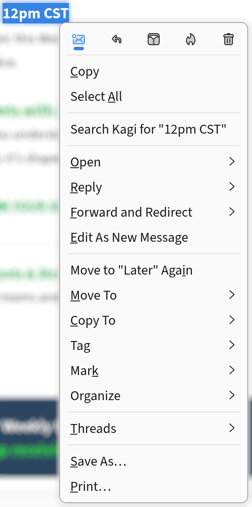

I got an email that had an unfamiliar time zone in it.
My intuition said that if I selected the text and right-clicked then I'd be closer to knowing what the corresponding local time was.
When I did, the best option I found was to search the web.

[The Kagi search](https://kagi.com/search?q=12pp+PST) *was* helpful, but I shouldn't need internet access to compute an answer.

Wouldn't it be cool if I could install a program that added this feature to relevant context menus?
And not only in Thunderbird, but in *every* program that has text and context menus?

<figure class="text-with-figure__figure" style="width: 12rem;">

<figcaption>Thunderbird's context menu for a text selection</figcaption>
</figure>

