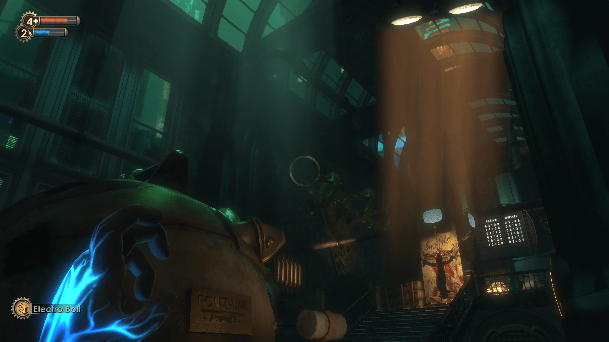

I recently finished playing Bioshock. It only took two years.

<!-- generated -->

One reason I'm interested in Bioshock is its pedigree in the gaming industry.
Bioshock (2007) was co-developed by [Irrational Games / 2K Boston](https://en.wikipedia.org/wiki/Irrational_Games) and [Irrational Games Australia / 2K Australia](https://en.wikipedia.org/wiki/2K_Australia).
As an Australian, I was excited to learn about Australian involvement in such a famous game.
When it was shut down in 2015, 2K Australia was [the last AAA studio in Australia](https://web.archive.org/web/20180219031310/https://www.kotaku.com.au/2015/04/the-heartwarming-response-to-the-closure-of-2k-australia/).
It was also the primary developer of the somewhat entertaining [Borderlands: The Pre-Sequel](https://en.wikipedia.org/wiki/Borderlands:_The_Pre-Sequel), a Borderlands (❤) spin-off set on [Pandora](https://borderlands.fandom.com/wiki/Pandora)'s moon, which is apparently inhabited by Australians.

Irrational Games was founded by a few ex-employees of [Looking Glass Studios](https://en.wikipedia.org/wiki/Looking_Glass_Studios),
which was a pioneer in the art of video games.
I think a large part of Bioshock's success can be traced to work done at Looking Glass.
Looking Glass is also [linked](https://en.wikipedia.org/wiki/Ion_Storm#Deus_Ex) to the formation of Ion Storm Austin (Ion Storm itself being founded by [id Software](https://en.wikipedia.org/wiki/Id_Software) founders, but that's a rabbit hole for another time) and the development of [Deus Ex](https://en.wikipedia.org/wiki/Deus_Ex_(video_game)),
another critically acclaimed game of the era.

## Looking Glass Studios' approach to game design

Looking Glass Studios produced three particularly influential games (plus sequels):
[Ultima Underworld (1992)](https://en.wikipedia.org/wiki/Ultima_Underworld:_The_Stygian_Abyss),
[System Shock (1994)](https://en.wikipedia.org/wiki/System_Shock),
and [Thief (1998)](https://en.wikipedia.org/wiki/Thief:_The_Dark_Project).
A big part of what makes these games great is the thought and effort that went into the game design behind them.

These games increasingly emphasise player agency and creativity.
Instead of relying on scripted sequences of events, the games have many independent systems that dynamically interact.
All the entities in the game are subject to the same set of rules, and the player is just one participant in this virtual world.
Challenges presented to the player don't have a pre-determined solution, rather,
it's up to the player to figure out how to use the systems at their disposal to overcome the challenge.
With enough independent but interacting systems,
there end up being many solutions that the game developer never anticipated.
This style of game is now called an ["immersive sim"](https://en.wikipedia.org/wiki/Immersive_sim),
of which [Game Maker's Toolkit  has an entertaining overview](https://www.youtube.com/watch?v=kbyTOAlhRHk).

> Aside: some of the people at Looking Glass thought *hard* about game design.
[Doug Church](https://en.wikipedia.org/wiki/Doug_Church) published [this interesting article](https://www.gamedeveloper.com/design/formal-abstract-design-tools) about making game design more technical.
> And [Marc LeBlanc](https://en.wikipedia.org/wiki/Marc_LeBlanc) coined the [8 kinds of fun](https://en.wikipedia.org/wiki/Marc_LeBlanc#8_Kinds_of_Fun) and has created a [wealth of materials on game design](http://8kindsoffun.com/).

The principles behind immersive sims appeal to me because of how they reflect real life.
Growing up I played a lot of RPG-style video games: fight enemies, gain experience points and items, level up, unlock skills, etc.
Looking back, I see that a big reason I was drawn to this sort of game was its simulation of progress.
Leveling up or crafting a rare item felt like an achievement at the time, but in hindsight they feel hollow.
The levels I gained in some MMORPG are mostly just bits on a server somewhere; little evidence of them remains in me as a whole human being.
Growth of a virtual video game character was a cheap and low-risk way to get a sense of personal growth,
but without the lasting rewards.
After realising this, I started looking for games that reinforce skills I actually value,
thereby leaving a positive impression on *me*, rather than just increasing some numbers on a computer.
Immersive sims create opportunities for agency and creativity: behaviours which matter to me in general.

I'm also intrigued by the way the immersive sim approach creates depth.
To me, depth is one of the components of art:
when you can continually go back to a work and experience it in new ways,
gradually uncovering more of what's already there.

## Outline

* Game development lineage
  * [Looking Glass Studios](https://en.wikipedia.org/wiki/Looking_Glass_Studios) and [Irrational Games](https://en.wikipedia.org/wiki/Irrational_Games)
    * Considered to have pioneered the ["Immersive sim"](https://en.wikipedia.org/wiki/Immersive_sim) genre
    * [System Shock](https://en.wikipedia.org/wiki/System_Shock) & [System Shock 2](https://en.wikipedia.org/wiki/System_Shock_2)
    * [Thief](https://en.wikipedia.org/wiki/Thief:_The_Dark_Project) & [Thief 2](https://en.wikipedia.org/wiki/Thief_II)
  * Irrational Games Australia [formed in ~2000](https://web.archive.org/web/20010203123200/http://irrationalgames.com/news_archived.cfm), renamed to [2K Australia](https://en.wikipedia.org/wiki/2K_Australia) after being acquired by a holding company.
    * Codeveloped Bioshock
* Game design
  * Relationship to the ["immersive sim"](https://en.wikipedia.org/wiki/Immersive_sim) genre
    * [Introduction to immersive sims by Game Maker's Toolkit](https://www.youtube.com/watch?v=kbyTOAlhRHk)
      * "Agency"
    * Game design thinking at Looking Glass
      * Marc LeBlanc with "MDA" and [the 8 kinds of fun](http://algorithmancy.8kindsoffun.com/)
      * Doug Church with [Formal Abstract Design Tools](https://www.gamedeveloper.com/design/formal-abstract-design-tools)
  * [Puzzles are problems with a single solution](https://www.raphkoster.com/2025/11/03/game-design-is-simple-actually/#:~:text=If%20a%20problem%20basically%20has%20one%20answer,%20we%20often%20call%20it%20a%20puzzle.)
    * We end up finding algorithms to solve the puzzle
    * Once you know the algorithm, executing it is straightforward
      * Lacks creativity
      * Boring, makes me feel like a machine
      * Frustrating if your mind doesn't work the same way as the creator's mind
      * Examples:
        * Arithmetic
        * Jigsaw puzzles
        * Sudoku
  * The "immersive sim" approach uses problems that don't have a single intended solution.
    * The game provides you highly general systems, and challenges you to acheive a particular outcome.
      You get to figure out how to use these systems to reach the goal.
    * More realistic, more relevant to the rest of life, which I find more fun
      * This is not an *objective* benefit

        <https://www.pcgamer.com/the-uncertain-future-of-games-like-deus-ex-and-dishonored/>

        > it's clear that there hasn't been a huge immersive sim hit on par with some of the other video games out there.
        > I mean, we're still waiting for the game that sells a gazillion copies!
        > I think part of the reason for that is that immersive sims require—or at least encourage—people to think before they act.
        > They tend not to be games where you just move forward like a shark and inevitably succeed.
        > In the best immersive sims, you have to assess the situation you're in, make a plan and then execute that plan, dealing with any consequences that follow.
        > That's asking a lot of players who basically have to do that every moment of their waking lives—in the real world, I mean.

    * Encourages creativity
      * What are some plausible ways I could achieve that goal?
        Which of those are available to me given the rules of the game?
* I feel inspired looking at old Looking Glass / Irrational Games web pages
  * Web archive gems
    * [Thief dev blog](http://www.thief-thecircle.com/darkproj/darkdiary.html)

      [Design manifesto](http://www.thief-thecircle.com/darkproj/manifesto.html)

    * <https://web.archive.org/web/19970203172654/http://www2.lglass.com:80/employee.html>
      * <https://web.archive.org/web/19990128131802/http://brigit.lglass.com/%7Emahk/>

        "Why the hell are you reading this?"

      * <https://web.archive.org/web/19970314211921/http://www2.lglass.com/~tjs/>

        "How am I like the Demiurge?"

      * <https://web.archive.org/web/19990220072253/http://www.folded.com/jeff/>

        "Not a desert mouse" (?!)

      * Optimised f(n)or(d) pineal web
        * 
        * <https://web.archive.org/web/19990129033550/http://brigit.lglass.com/%7Emahk/who.html>
        * <https://web.archive.org/web/19990504185146/http://www.folded.com/jeff/jeff.html>
        * <https://www.cs.cmu.edu/~tilt/pinealweb/>
* It took me so long to finish because it was scary and stressful
  * The sound design had me on edge
  * Creepy enemies
  * I gave up on it for over a year, but wouldn't let myself play any other games until I finished this one
  * Recently I've been working on getting out of my comfort zone, so I decided that this was a good challenge for me.
    * This game is one of the safest ways to experience discomfort. A purely virtual experience in my home.
    * Noticing how avoiding uncomfortable states helps keep me in an unsatisfying place in life
      * I have a cognitive bias toward predicting negative and unpleasant outcomes
        * I also have the belief that it's important for me to avoid discomfort
        * Therefore I will avoid doing things that matter to me to minimise the risk of negative outcomes
          * But by avoiding the thing I necessarily also rule out the positive outcomes
      * Instead, practise acting in spite of the discomfort
        * Even though it feels like "too much", in each moment that you experience the discomfort *you are handling it*
        * "I am scared right now, but I don't *need* to be not-scared right now."
