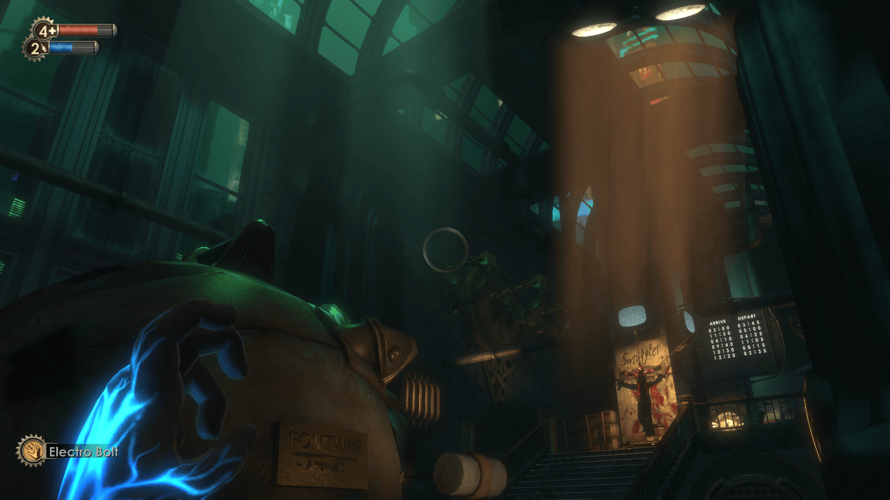

In October 2025 I finished playing BioShock. It only took two years.

<!-- generated -->

One reason I'm interested in BioShock is its pedigree in the gaming industry.
BioShock, released in 2007, was co-developed by [Irrational Games / 2K Boston](https://en.wikipedia.org/wiki/Irrational_Games) and [Irrational Games Australia / 2K Australia](https://en.wikipedia.org/wiki/2K_Australia).
As an Australian, I was excited to learn about Australian involvement in such a famous game.
When it was shut down in 2015, 2K Australia was [the last AAA studio in Australia](https://web.archive.org/web/20180219031310/https://www.kotaku.com.au/2015/04/the-heartwarming-response-to-the-closure-of-2k-australia/).

Aside

2K Australia was also the primary developer of the somewhat entertaining [Borderlands: The Pre-Sequel](https://en.wikipedia.org/wiki/Borderlands:_The_Pre-Sequel), a Borderlands (❤) spin-off set on [Pandora](https://borderlands.fandom.com/wiki/Pandora)'s moon, which is apparently inhabited by Australians.

Irrational Games was founded by a few ex-employees of [Looking Glass Studios](https://en.wikipedia.org/wiki/Looking_Glass_Studios),
which was a pioneer in the art of video games.
I think a large part of BioShock's success can be traced to work done at Looking Glass.
Looking Glass is also [linked](https://en.wikipedia.org/wiki/Ion_Storm#Deus_Ex) to the formation of Ion Storm Austin (Ion Storm itself being founded by [id Software](https://en.wikipedia.org/wiki/Id_Software) founders, but that's a rabbit hole for another time) and the development of [Deus Ex](https://en.wikipedia.org/wiki/Deus_Ex_(video_game)),
another critically acclaimed game of the era.

## Looking Glass Studios' approach to game design

Looking Glass Studios produced three particularly influential games (plus sequels):
[Ultima Underworld (1992)](https://en.wikipedia.org/wiki/Ultima_Underworld:_The_Stygian_Abyss),
[System Shock (1994)](https://en.wikipedia.org/wiki/System_Shock),
and [Thief (1998)](https://en.wikipedia.org/wiki/Thief:_The_Dark_Project).
A big part of what makes these games great is the thought and effort that went into their game design fundamentals.

Aside

Seriously, some of the people at Looking Glass thought *hard* about game design.
[Doug Church](https://en.wikipedia.org/wiki/Doug_Church) published [this interesting article](https://www.gamedeveloper.com/design/formal-abstract-design-tools) about making game design more technical.
And [Marc LeBlanc](https://en.wikipedia.org/wiki/Marc_LeBlanc) coined the [8 kinds of fun](https://en.wikipedia.org/wiki/Marc_LeBlanc#8_Kinds_of_Fun) and has created a [wealth of materials on game design](http://8kindsoffun.com/).

These games increasingly emphasise player agency and creativity.
Instead of relying on scripted sequences of events, the games have many independent systems that dynamically interact.
All the entities in the game are subject to the same set of rules, and the player is just one participant in this virtual world.
Challenges presented to the player don't have a pre-determined solution, rather,
it's up to the player to figure out how to use the systems at their disposal to overcome the challenge.
As the number of independent but interacting systems increase,
so do the number of solutions that the game developer never anticipated.
This style of game is now called an ["immersive sim"](https://en.wikipedia.org/wiki/Immersive_sim),
of which [Game Maker's Toolkit  has an entertaining overview](https://www.youtube.com/watch?v=kbyTOAlhRHk).

As [Raph Koster](https://www.raphkoster.com/) puts it:

> If a problem basically has one answer, we often call it a puzzle.
>
> Raph Koster &mdash; [Game design is simple, actually – Raph Koster](https://www.raphkoster.com/2025/11/03/game-design-is-simple-actually/)

The immersive sim approach to game design eschews puzzles, and that's part of why they're my kind of fun.

The principles behind immersive sims appeal to me because of how they reflect real life.
Growing up I played a lot of RPG-style video games: fight enemies, gain experience points and items, level up, unlock skills, etc.
Looking back, I see that a big reason I was drawn to this sort of game was its simulation of progress.
Leveling up or crafting a rare item felt like an achievement at the time, but in hindsight it's all hollow.
The levels I gained in some MMORPG are mostly just bits on a server somewhere; little evidence of them remains in me as a whole human being.
Growth of a virtual video game character was a cheap and low-risk simulacrum of personal growth that
lacked the lasting rewards.
After realising this, I started looking for games that reinforce skills I actually value,
thereby leaving a positive impression on *me*, instead of just increasing some numbers on a computer.
Immersive sims create opportunities for agency and creativity, which I generally value.

[Warren Spector](https://en.wikipedia.org/wiki/Warren_Spector)'s (Looking Glass Studios and Ion Storm) explanation for why immersive sims lack commercial success articulates precisely why they matter to me:

  > it's clear that there hasn't been a huge immersive sim hit on par with some of the other video games out there.
  > I mean, we're still waiting for the game that sells a gazillion copies!
  > I think part of the reason for that is that immersive sims require—or at least encourage—people to think before they act.
  > They tend not to be games where you just move forward like a shark and inevitably succeed.
  > In the best immersive sims, you have to assess the situation you're in, make a plan and then execute that plan, dealing with any consequences that follow.
  > That's asking a lot of players who basically have to do that every moment of their waking lives—in the real world, I mean.
  >
  > Warren Spector &mdash; [The uncertain future of games like Deus Ex and Dishonored | PC Gamer](https://www.pcgamer.com/the-uncertain-future-of-games-like-deus-ex-and-dishonored/)

I'm also intrigued by the way the immersive sim approach creates depth.
To me, depth is one of the components of art:
when you can continually go back to a work and experience it in new ways,
gradually uncovering more of what was there the whole time.

## Tangent: old websites!

[The Internet Archive](https://web.archive.org/) has
[snapshots](https://web.archive.org/web/20260000000000*/http://www.lglass.com/)
of Looking Glass Studios' website dating back to 1997.

Somehow I stumbled across their old
[employee home pages](https://web.archive.org/web/19970625103015/http://www2.lglass.com/employee.html).

Highlights:

* > [Why the hell are you reading this?](https://web.archive.org/web/19990128131802/http://brigit.lglass.com/%7Emahk/)
  >
  > 1. I wandered here by accident. I'm lost.
  > 2. I'm from the government, and I'm running a background check.
  > 3. You're dead, and I'm rummaging through your stuff.
  > 4. I actually went looking for this page.
  > 5. Why, I never! Who do you think you are?

* > [The home of Tim Stellmach](https://web.archive.org/web/19970314211921/http://www2.lglass.com/~tjs/)
  >
  > **How am I like the Demiurge?**
  >
  > | Demiurge | Stellmach |
  > |---|---|
  > | A creative, primeval diety | A creative, senior game designer |
  > | A feature of Gnostic theology | Said to have a great deal of "gnosis" |
  > | Said to be the "God" in the book of Genesis | Used to work for Origin Systems |
  > | Credited with creating the material world | Origin's motto was "We Create Worlds" |

* > [Not a Desert Mouse](https://web.archive.org/web/19990220072253/http://www.folded.com/jeff/)
  >
  > The continuing adventures of a young man who, in fits of comic dementia, thinks he's a
  > desert-dwelling rodent -- and the crazy friends that surround him. Starring Jeff Yaus
  > as "Jeff", the hapless twentysomething who keeps forgetting he's in fact an urban primate. 

I also found this image scattered around:

which always links to ["the Principia Discordia"](http://www.cs.cmu.edu/~tilt/principia/) ([archived](https://web.archive.org/web/19990508052433/http://www.cs.cmu.edu/%7Etilt/principia/)).
Searching for "pineal web" turned up [this page](https://www.cs.cmu.edu/~tilt/pinealweb/) ([archived](https://web.archive.org/web/19980122055107/http://www.cs.cmu.edu/~tilt/pinealweb/)).
I wish this became a meme when Facebook was trying to make its "metaverse" happen.

It's fascinatingly absurd.

On a (slightly) more serious note, I also found the original Thief website at
<http://www.thief-thecircle.com/darkproj/>.
It includes:

* A silly [credits page](http://www.thief-thecircle.com/darkproj/band.html) (with a [special version for recruiters](http://www.thief-thecircle.com/darkproj/headhunt.html))
* An entertaining [project diary](http://www.thief-thecircle.com/darkproj/diarymonth.html) that spans 18 months of development
* A brief [rant about "computer role-playing games"](http://www.thief-thecircle.com/darkproj/manifesto.html)

I found it all quite inspiring.
It's a reminder that you don't need huge teams to make *good* games,
and even though you're trying to be successful, you're allowed to have fun on the way.

## Why I took so long to finish BioShock

BioShock has a [survival horror](https://en.wikipedia.org/wiki/Survival_horror) feel to it,
which is a style of game I've never been fond of.
It has a creepy atmosphere with enough jump scares to keep you cautious,
so I was constantly stressed.
Not my kind of fun.
As a result, I procrastinated from playing it for over a year because I was rarely willing to handle that stress.
At the same time,
I was committed to finishing BioShock before I played another game,
so I was regularly reminded of my procrastination when friends recommended games to me.

About halfway though 2025 I began changing my life in a way conflicted with this procrastination:
forming the intention to do more "uncomfortable" things.

I had noticed that for a long time I'd been avoiding more and more uncomfortable things;
things that might bring up difficult emotions such as fear, sadness, or shame.
At the same time, I had become increasingly dissatisfied with my life and the direction I was heading.
I realised that the dissatisfaction was *caused* by my avoidance,
because the direction I *actually* want for my life requires me to continually confront unpleasant emotions.
By avoiding those emotions, I became stuck in a comfortable yet unsatisfying rut.

From this point of view, BioShock became an extremely low-stakes way to stop avoiding *something* and feel some unpleasant feelings.
One repetition of the kind of movement I need to get out of the rut.
I knew that the fear generated by playing the game was completely disconnected from the real world,
with no potential for negative consequences besides the feeling itself.
With that in mind, I resumed playing with the intention to feel the stress and fear instead of trying to minimise them.
I think this attitude actually made the game less stressful, because I wasn't trying so hard to control my experience.
But it didn't change the fear; the game was still creepy and scary, I just started moving towards the fear instead of hiding from it.
I had a similar opportunity more recently while playing a haunted house VR game at [Zero Latency](https://zerolatencyvr.com).
My instinct was to minimise my fear by staying away from suspicious places, looking away from creepy characters, and so on.
When I realised what I was doing, I decided to open myself to the experience and feel whatever came my way.
The game finished after I looked an ugly ghost-witch thing in the eyes as it rushed at me head on, to my character's demise.

These experiences (plus a subsequent bungy jump) demonstrated that I really can handle the feelings I'm tempted to avoid.
In reality this was already the case (and always has been),
but when faced with potentially difficult emotions I can feel like they must be avoided at all costs,
as if experiencing it will be the end of me.
When I remember what it felt like to move towards the fear, feel it, and come out the other side, it widens my perspective.
That sense that the world is at stake decreases,
which gives me the freedom to
[make the right choice](https://blog.ielliott.io/doing-the-right-thing)
even if I think it'll be uncomfortable.

Now I'm starting to look at discomfort as simply the price of action,
and it's the kind of transaction where trying to haggle or penny-pinch just makes everything worse.
My life so far has resulted in *this* body and mind, with specific capabilities, attachments and patterns of thought,
which sometimes means feeling bad is a *necessary* consequence of my actions:

* If I play through BioShock then I'll often feel scared (because I'm just a bit sensitive)
* If I lift a heavy weight then my muscles will hurt (because that's how muscles generally work)
* If I start a romantic relationship with someone then I'll grieve the end of the relationship (because I've grown to love them)

In the past I prioritised avoiding potential uncomfortable consequences.
I either lacked a vision of how I want my life to be (so "feeling good" became the placeholder)
or put my short-term comfort ahead of whatever vision I had.
Now I'm paying more attention to what I actually want for myself, and then pursuing it with a willingness to pay whatever price is actually required.
