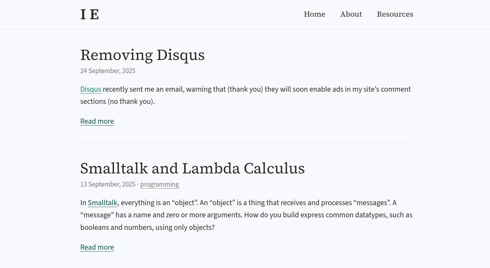
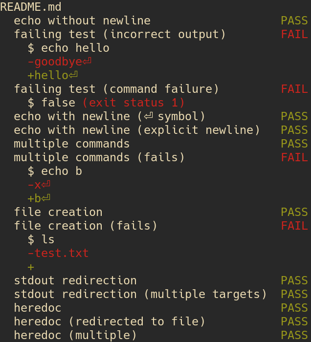

<div id="toc"><!-- generated --></div>

## Blog {toc:omit_children=true}

*ongoing*

### Posts

* [Removing Disqus](/removing-disqus)
* [Smalltalk and Lambda Calculus](/smalltalk-and-lambda-calculus)
* [A Haskell &#34;Foldable&#34; quiz](/haskell-foldable-quiz)
* [Paying for KeePassXC](/paying-for-keepassxc)
* [Exploring a dependency graph with Prolog](/exploring-graphs-with-prolog)
* [Context menus](/context-menus)
* [Playing with GHC package databases](/playing-with-ghc-package-databases)
* [My Git CLI overhaul](/my-git-cli-overhaul)
* [In Praise of ZSA](/in-praise-of-zsa)

I wrote more posts this year than I did last year.
I've decided that I want to post interesting thoughts that either don't work as articles or that I'm just not interested in expanding on too much.
The idea is to lower the standard of what's shareable so that I share more often.
This is inspired by my slow retreat from popular social media;
I want to retain a presence on the Web, but on my own terms.
Posting on my own site is the best way to do that.

### Site improvements

* Restyle

  <div style="display: flex; flex-direction: row; gap: 1rem;">
  <figure>
  <a href="images/20260111-site-restyle-before.png" target="_blank"></a>
  <figcaption>Before</figcaption>
  </figure>
  <figure>
  <a href="images/20260111-site-restyle-after.png" target="_blank"></a>
  <figcaption>After</figcaption>
  </figure>
  </div>

  Cleaned things up and improved content density.
  I also removed Google Analytics and Fonts.

* ["Reply" content type](https://github.com/LightAndLight/lightandlight.github.io?tab=readme-ov-file#replies)

  This content type is for short responses and thoughts.
  I originally added it so that I could make a [short comment](https://blog.ielliott.io/reply/202508052146) that responding to a section of a previous post.
  Later I made "referencing a previous post" optional so that I could write a [standalone note](https://blog.ielliott.io/note/202508160025).

  <!-- TODO: note about how I want distributed "social media"? -->

## Type-passing compilation

*January*

<https://github.com/LightAndLight/type-passing-compilation> (private)

Starts implementing the idea I wrote about in [2023 Project Review: Low-level IR compiler](https://blog.ielliott.io/2023-project-review#low-level-ir-compiler).
The gist is: passing around [vtables](https://en.wikipedia.org/wiki/Virtual_method_table) of memory manipulation functions for polymorphic types,
instead of monomorphising or forcing everything to be heap-allocated.

I stalled while thinking about support for higher-kinded polymorphism.
It requires allocating new vtables at runtime,
which felt kind of complicated so I was hesitant to commit to it.
The point of this project, though, is to find out whether that sort of runtime cost is worth it.
So I really just need to find a way to simplify what I'm trying to build so that I can test it.

At [ZuriHac](https://zfoh.ch/zurihac2025/) people reminded me of [Sixten](https://github.com/ollef/sixten),
which passes around sizes instead of a full vtable.
I think this works because Sixten uses a [tracing garbage collector](https://en.wikipedia.org/wiki/Boehm_garbage_collector),
so it can treat pointers as regular data and just copy them around.
I'd like my version to support reference counting,
which means the behaviour of copying data depends on the type.
For example, simple types are just `memcpy`ed, whereas copying a pointer also needs to increment a reference count.

See also: <a href="#talk-a-third-way-of-compiling-polymorphism">Talk: A “third way” of compiling polymorphism</a>

## `mdpreview`

*January*

<https://github.com/LightAndLight/personal-configs/tree/533bc27168fc155b56ed055294b9feda06308733/system/packages/mdpreview>

`mdpreview` is a script that translates a Markdown document to HTML.
It's an easy way to render a Markdown file to check I've formatted it correctly.
It creates a new HTML file every time it's run, so one improvement would be to have it watch a file and re-render on change, so that I can just refresh page after editing to view the changed document.

## LastPass to KeepassXC migration

*January&ndash;June*

* <https://blog.ielliott.io/paying-for-keepassxc>
* <https://github.com/LightAndLight/personal-configs/blob/533bc27168fc155b56ed055294b9feda06308733/home/keepassxc.nix>

I moved all my account information from LastPass to a local KeepassXC database.
I changed hundreds of passwords, which was very boring, but now I'm glad that I did it.
One of my favourite things about using a normal program (rather than a web app) is that it's subject to *way* less churn.
It feels like these big web app "software as a service" companies are always tweaking, fiddling, and breaking things.
With a normal program, I can choose when to update it, if ever.

I also submitted a [patch](https://github.com/keepassxreboot/keepassxc/pull/12236) to KeepassXC
to make it work better with [home-manager](https://nix-community.github.io/home-manager/),
which was included in KeepassXC version 2.7.11 and NixOS 25.11.
If this was a closed source or web program, I wouldn't have been able to fix it myself.

To access my passwords from my mobile phone,
I use [Syncthing](https://syncthing.net/) with [Syncthing-Fork / syncthing-android](https://github.com/researchxxl/syncthing-android) to sync the password database,
and [KeepassDX](https://github.com/Kunzisoft/KeePassDX) to read the database on the phone.
I'm considering setting up a small server to make syncing a bit easier.

## GMail to Fastmail migration

*February*

I'm slowly moving my data away from Google, and I decided to work on my emails first.
This year I'll probably do file storage.

I briefly looked into running my own email server, but I got the impression that the current email ecosystem is hostile toward new/small servers.
After deciding not to mess around with that stuff, I tried [Fastmail](https://www.fastmail.com/).
Their free trial month went by without any issues so I bought a yearly subscription.

I use the [Thunderbird](https://www.thunderbird.net/) email client instead of the Fastmail web client (you might notice a pattern here).
I'm not very satisfied by Thunderbird, but it's good enough for now.
It could be fun to write my own email client one day.

## Devops practise

*March*

<https://github.com/LightAndLight/infra> (private)

I played around with using [SOPS](https://github.com/getsops/sops) to encrypt [Terraform/Tofu](https://opentofu.org/) state so that I can version it in Git.
I like this approach more than e.g. setting up object storage somewhere to use as a Terraform backend.

## Feeds for YouTube subscriptions

*March*

* <https://lectio.news/>
* <https://news.ycombinator.com/item?id=44412109>

I created a service that turns my YouTube subscriptions into an RSS/Atom feed.

I have two problems with YouTube's website and apps:

1. They're extremely distracting; full of ads and recommendations
2. It's yet one more "thing" to check and I can't be bothered

Putting my YouTube subscriptions into my feed reader solved these problems for me,
and I'm extremely satisfied with the result.
Now when I open up my feed reader I see who's written new articles, *and* whether YouTube channels I've subscribed to have uploaded new videos.
I then get to decide whether to read an article or watch a video.

I was surprised by the rate of new uploads for my YouTube subscriptions.
A lot of them are TikTok-style short videos, which I think is a bit gross.
Fortunately the feed just shows me the title, duration, and description, which gives me a dense summary of many videos and makes it easier to decide what not to watch.
In contrast, I find the "swipe through auto-playing portrait-orientation short videos" interface to be an extremely slimy design pattern.
It's like gambling with your attention, *hoping* that the next one will be something you actually wanted to see.

Currently the code for this service is private because I'm curious whether anyone would like to pay for it.

## `gen-alias`

*March*

<https://github.com/LightAndLight/gen-alias>

After switching to Fastmail I learned of their [masked email](https://www.fastmail.help/hc/en-us/articles/4406536368911-Masked-Email) feature.
1Password and Bitwarden support generating masked emails ([1](https://www.fastmail.com/blog/masked-email-from-fastmail-and-1password-protects-your-identity-online/), [2](https://www.fastmail.com/blog/masked-email-now-in-more-places-with-bitwarden-integration/)) via
a [JMAP API](https://www.fastmail.com/dev/#:~:text=Masked%20Email%20API),
but KeepassXC doesn't.
I wrote a program that used the JMAP API directly and realised that I didn't like the format of the masked emails it generated.
I wanted `{service}.{randomId}@{domain}`, but the Fastmail API doesn't allow `.` in the masked email prefix.
I wrote `gen-alias` to work around this.

I set up a subdomain of `ielliott.io` with my Fastmail MX records specifically for these unique email addresses.
I configured Fastmail to send `*@{subdomain}.ielliott.io` to my main mailbox.
When an online service needs an email address, I use `gen-alias` to generate `{service}.{randomId}@{subdomain}.ielliott.io`,
which I paste into my password manager and the online form.

I really like this setup; it's already helped me identify services that attract spam.
My main source of spam in 2025 was via my GitHub profile.
Second to that was software development consultant spam to an email address that was on [a page](https://lectio.news) I [submitted to Hacker News](https://news.ycombinator.com/item?id=44412109).

## PDF form filling web app

*April*

This was my first real contracting gig!
The business I worked with constantly fills out PDF forms that are published by the Australian Govenment.
Some information, such as identity or contact details, is repeated across many forms.
I prototyped a web app that allows the user to auto-fill many of the form fields, enter the remaining fields manually, then generate the PDF.

The official PDFs have (mostly working) form field annotations, so PDF viewers render the documents with interactive fields.
I created a "mapping" format that describes field types (text, multiple-choice, etc.), and the relationship between the logical form fields and the PDF form field annotations.
Most of the mapping can be automatically generated from a PDF,
after which can be used to render the web version of the form (e.g. so that you don't create a HTML text field for a checkbox field),
and insert/extract data into/from the corresponding PDF.

I enjoyed working on such an obviously useful project.
One frustrating part of my career so far is how often companies have lacked clarity in the problems they're solving or the product they're creating.
This shows up as: trying to measure user engagement with features ("We're not sure what we want so let's build a few things and see what users like."),
factions competing for product direction ("What do you mean 'We're building an X.'? We're building a Y!"),
or "bottom-up" development ("Hey team, each of you gets to decide what you want this to be.").
That's not really my style; I prefer to form an opinion of what to create and then bring that into the world.
In this project, the core idea was solid with no room for equivocation, and it was my job to make it happen.

## Learning PDF

*April*

<https://github.com/LightAndLight/pdf> (private)

In the PDF form filling web app I used [`pypdf`](https://pypdf.readthedocs.io/en/stable/) for PDF manipulation,
because I didn't trust that there'd be an easy-to-use Haskell PDF library.
After I finished, I tried writing my own Haskell PDF library based on
[the PDF 1.7 spec](https://opensource.adobe.com/dc-acrobat-sdk-docs/pdfstandards/PDF32000_2008.pdf).
I made some progress, including support for compressed streams objects and password-based encryption,
but I don't plan to turn it into something publicly usable.

PDF internals are pretty interesting.
It's a texual format, and there's syntax for values like booleans, integers, dictionaries, etc.
There's also a way to reference to values defined elsewhere in the document.
One cool part of the design is that PDFs are read by seeking to the end of the file and working backwards.
This way a document can be revised by appending to the file.
If you want to know more,
[Inside the PDF File Format](https://commandlinefanatic.com/cgi-bin/showarticle.cgi?article=art019) is good introduction.

## Talk: A "third way" of compiling polymorphism

*April*

* [source](https://github.com/LightAndLight/polymorphism-third-way-talk)
* [slides](https://blog.ielliott.io/talks/polymorphism-third-way.pdf)

I presented the ideas behind [type-passing compilation](#type-passing-compilation) at the [Brisbane Functional Programming Group](https://bfpg.org/).

## Experimental templating language

*May*

<https://github.com/LightAndLight/tpl> (private)

I played around with a template language like [Mustache](https://mustache.github.io/) or [Jinja](https://jinja.palletsprojects.com/en/stable/).

There were two new things I wanted to try:

* Explicitly defined, typed template variables

  For example, instead of writing

  ```
  Hello, {name}!
  ```

  you'd write

  ```
  
  Hello, {name}!
  ```

  This lets you easily ask a template what kind of variables it needs.

* Expression-oriented substitution

  In Mustache or Jinja, to subsitute a list you need use an open tag and closing tag:

  Mustache:

  ```
  <ul>{{#list_of_things}}
    <li>{{list_item}}</li>
  {{/list_of_times}}</ul>
  ```

  Jinja:

  ```
  <ul>
    <li>{{ list_item }}</li>
  </ul>
  ```

  I want to use `{}` for substitution, and push iteration into an expression.
  Something like:

  ```
  <ul>{for list_item in list_of_things yield <li>{list_item}</li>}</li>
  ```

I was also curious what it would look like to write a high-performance bytecode interpreter for these templates,
and how that should be integrated into a web server.
For example, maybe the server could precompile all the templates on startup.

## `mdtest`

*May*

<https://github.com/LightAndLight/mdtest>

`mdtest` was inspired by the way I wrote the spec for the experimental template language above.
I created a Markdown document with code blocks that mimicked a command line: a command followed by the expected output.
`mdtest` runs such code blocks and prints a summary.

Here's what it prints when run against the project's
[README](https://github.com/LightAndLight/mdtest?tab=readme-ov-file#mdtest):

<figure>

<figcaption>Screenshot of my terminal's `mdtest` output</figcaption>
</figure>

## Type-safe web routing

*July*

<https://github.com/LightAndLight/misc/tree/main/20250704-faster-typesafe-web-routing>

A simplified version of <https://blog.ielliott.io/2024-project-review#functional-web-routing>.
Sketches a type-safe approach to [`scotty`](https://hackage.haskell.org/package/scotty)-style web servers.
At it's core it contains a trie-like data structure for routing.
In addition to routing web requests, the trie can be used to render a sitemap or API schema.
It can also be used to render type-safe URLs.

I don't remember what this is supposed to be faster than, though.

## Datalog adventures

*August*

* <https://blog.ielliott.io/exploring-graphs-with-prolog>
* <https://github.com/LightAndLight/misc/tree/main/20250806-datalog>

I learned that logic programming languages can be used to query databases.
My first time around I translated my data into a big Prolog file and which I imported into the Prolog REPL to write queries against.
Then I wrote my own Datalog-inspired system to learn about how these systems really work.
[Foundations of Databases](http://webdam.inria.fr/Alice/) was an excellent (and freely available) textbook for this adventure.

The Datalog-style approach to relational databases feels more elegant than SQL.
I'd like to take it a bit more seriously in the future.

## Pharmacy report generator

*August*

I have a close friend who works at a pharmacy, and part of their job is to create weekly reports (as spreadsheets) for doctors,
with updates about the status of patents' prescriptions.
They spent hours each week doing this by hand.
I wrote a Python program using [BeeWare](https://beeware.org/) that reads CSV files and generates the spreadsheet reports.
It saves them hours every week and they've thanked me several times :)

The program is configured in [HCL](https://github.com/hashicorp/hcl?tab=readme-ov-file#hcl),
so the processing can be changed as new doctors come on board or column formatting requirements change.
My friend is not a programmer, but they're not helpless either, so they've been able to learn how to change the config format to achieve their goals.
When they're unsure they double-check with me.
The next step would be to create a GUI for the config so that it's easier to change.

## System font fixes

*August*

* <https://github.com/LightAndLight/personal-configs/blob/533bc27168fc155b56ed055294b9feda06308733/system/fonts.nix#L4-L25>
* <https://github.com/LightAndLight/personal-configs/blob/533bc27168fc155b56ed055294b9feda06308733/machines/desktop/default.nix#L26>
* <https://github.com/LightAndLight/personal-configs/blob/533bc27168fc155b56ed055294b9feda06308733/machines/thinkpad-x1-carbon-gen12/default.nix#L39>

Firstly, I did a bunch of config-wrangling on NixOS to fix my font stack.
I discovered that some common fonts that websites assumed would be on my system were missing (e.g. Georgia/Gelasio) or failing to match (Linux Libertine/Linux Libertine O).
After that I went a bit overboard and set my fonts to roughly the same perceptual size across my desktop and laptop.
The physical font size on my laptop is smaller than that of my desktop,
but appears similar to my desktop's font size because my laptop screen is closer.

## `diagnostica` and `diagnostica-sage` improvements

*September*

* <https://github.com/LightAndLight/diagnostica>
* <https://github.com/LightAndLight/diagnostica-sage>

`diagnostica` is my CLI error diagnostics library.
I started writing a Haskell HCL parser after working on the Pharmacy report generator and I used `diagnostica` to render syntax errors.

I found that `diagnostica` only worked properly for ASCII documents,
displaying errors incorrectly in the presence of >1 byte UTF-8 characters.
It was easy to fix, but there's a related issue which I haven't yet addressed.
`diagnostica` uses the `^` character to "underline" some text,
but that only works when the number of glyphs displayed on the line above matches the number of Unicode code points.
When a font or [text shaper](https://harfbuzz.github.io/why-do-i-need-a-shaping-engine.html) combines adjacent characters,
`diagnostica` generates too many `^`s.
I think the right way to fix this would be to remove the `^`s altogether and emit an [underline escape sequence](https://en.wikipedia.org/wiki/ANSI_escape_code#:~:text=underline) instead.

## Smalltalk

*September*

<https://blog.ielliott.io/smalltalk-and-lambda-calculus>

I got curious about Smalltalk after listening to someone talk about [the Gleam programming language](https://en.wikipedia.org/wiki/Gleam_(programming_language)).
Gleam adds types to many of Erlang's patterns, so I was thinking about Erlang and realised that Erlang processes are essentially objects in the Smalltalk sense.

I started wondering what else can be thought of as an object.
The first interesting answer was: web servers.
I installed [Pharo](https://pharo.org/) and managed to write some code that turned any Smalltalk object into a web server.
It was surprisingly easy, and I suppose that's because what I wanted to do was consistent with the Smalltalk design ethos.

After that, I kept playing with Pharo because I wanted to get a better sense of what it's like to write code "the Smalltalk way".
I wrote a lambda calculus interpreter.
As part of that project I wrote a parser combinator library, which fit quite well into the Smalltalk paradigm.
Think of a primitive, such as `satisfy : (Char -> Bool) -> Parser Char`, as a "cell" whose only responsibility is parsing a character that satisfies the predicate.
Then a combinator like `(<*>) : Parser (a -> b) -> Parser a -> Parser b` is a way to create a bigger cell that delegates work to two smaller cells then combines the result.
In the end, a grammar is an intricate network of cells that work together to parse some text. 
It worked out great, and I think that's because parser combinators are implemented using functions, which are a simple kind of object (an objects are a special kind of function).

I also thought a lot about the role of *data* (as opposed to [codata](https://en.wikipedia.org/wiki/Coinduction)) in an object-oriented language.
In Smalltalk, everything is an object, so everything is coinductively defined.
You can still define datatypes via [Church encoding](https://en.wikipedia.org/wiki/Church_encoding),
but what if that's not idiomatic; just a trick to express an idiom from other programming environments?

My conclusion is that data is still necessary.
Smalltalk emphasises late binding: the recipient of a message decides how to respond.
This adds flexibility, because the receiver can its behaviour without while the code that sends the message remains the same.
Data allows late binding the "interpretation" of something.
When you define a datatype you may have a couple of use cases in mind, like a syntax tree that you can print or evaluate.
But there's an infinite number of ways that other people might want to use that data, such as simplifying the syntax tree or calculating some statistics about it.
Data is the most flexible representation of structure,
allowing the holder of the data decide on an interpretation without modifying the definition of the data structure.

## `mtl` patch

*October*

<https://github.com/haskell/mtl/pull/171>

An [`mtl`](https://hackage.haskell.org/package/mtl) maintainer pinged me on an [issue I created years ago](https://github.com/haskell/mtl/issues/84),
so I submitted a patch for it.
The change adds instances for the
[functor product](https://hackage-content.haskell.org/package/base-4.22.0.0/docs/Data-Functor-Product.html#t:Product).

The original motivation for this was to test "records of functions".
If you have some overloaded effectful operations:

```haskell
data Ops m
  = Ops
  { op1 :: A -> m B
  , op2 :: C -> m D
  ...
  }
```

then you may end up writing a derived overloaded operation that uses an MTL type class:

```haskell
derivedOp :: MonadError YourError m => Ops m -> X -> m Y
derivedOp = ...
```

Using the functor product, two `Ops` can be combined into a single `Ops` that runs two operations in lockstep:

```
pairOps :: Ops m -> Ops n -> Ops (Product m n)
pairOps m n =
  Ops
    { ops1 = \a -> Pair (ops1 m) (ops1 n)
    , ops2 = \c -> Pair (ops2 m) (ops2 n)
    , ...
    }
```

You can then write tests that calls a function from `Ops (Product m n)` and compares the outputs on each side of the pair.
If you want to test a function like `derivedOp` in this way then you need an instance for `MonadError e (Product m n)`.

## `hdeps`

*October*

<https://github.com/LightAndLight/hdeps>

`hdeps` is a tool that makes it easy to override Haskell dependencies in [`nixpkgs`](https://github.com/NixOS/nixpkgs).

Sometimes I have a project that builds with Cabal,
then discover that the `nixpkgs` version I want to build my project against has a Haskell package set that's incompatible with the version bounds on my transitive dependencies.
When this happens, I don't want to fork a bunch of packages just to twiddle with their version bounds.
Instead, I want to tell Nix to use the versions of Haskell packages that I know are already working.
`hdeps` makes this super easy.

It reads a manifest that says,
"get this package version from Hackage, that package version from GitHub, etc."
and generates a Nix overlay that can be used to extend `nixpkgs`'s Haskell package set.
It can also manage your `cabal.project` file to ensure that your Cabal builds use the same packages that are in the overlay.

I'm curious what it'd be like to generate the Nix overlay using Cabal's [`plan.json`](https://hackage.haskell.org/package/cabal-plan).
Then you could just say, "give me a Nix overlay corresponding to my build plan" and not have to go through the loop of building with Nix, observing the due to version bounds failure, then overriding the offending package.
Maybe this would be better as a separate tool, though.

## `sage` fixes

*November*

<https://github.com/LightAndLight/sage>

`sage` is my fast, low-allocation parser combinator library.
It had a gnarly, almost non-determistic bug that I'd been aware of since my work on [`diagnostica` and `diagnostica-sage` improvements](#diagnostica-and-diagnostica-sage-improvements),
but for a long time I was stumped.
At my wit's end, I decided to run the code through a large language model to see if I had missed anything.
The LLM suggested that there was a potential laziness issue where an `Addr#` was sticking around in a thunk and being garbage collected before the thunk was force.
This was indeed the problem, and I fixed the bug by changing a `$` to a `$!`.
 
## `tsk`

*October&ndash;December*

* <https://github.com/LightAndLight/tsk>
* <https://tsk.ielliott.io/>

`tsk` is an attempt at local-first task tracking.
I used [Todoist](https://www.todoist.com/) for a long time, sometimes paid and sometimes free.
In 2025 I decided that I didn't want to use a software-as-a-service for something I could write myself.

The task "database" is a [replicated datatype](https://en.wikipedia.org/wiki/Conflict-free_replicated_data_type),
which means that no matter how the database diverges due to edits on different devices,
the divergences can always be automatically reconciled.
Sometimes this results in "conflicts" when there are multiple competing values for a field.
The difference between `tsk` and something like Git is that the program doesn't abort on merge conflicts;
now the conflicting field has more than one potential value.
As the user, you get to make a new edit that makes one of the candidate values canonical,
or you can overwrite it with something new. 

The database is stored as a single binary file, whose format is documented [here](https://tsk.ielliott.io/v0).
That documentation is generated from the same code that encodes/decodes the binary format,
so it's easier to keep the documentation in sync (I'm quite proud of this!).

`tsk` uses the system's editor and pager as its interface.
`tsk task new` opens `$EDITOR` with a "new task" template,
and after saving and exiting it parses the file, updates the database in memory, then overwrites the database on disk.
`tsk task edit ID` loads the database into memory, looks up the task, and then prints it to a temporary file that's opened in the editor.
`tsk task view {ID}` does a similar thing but sends the printed task to `$PAGER` instead of an editor.
I think it's cool to have a textual interface to a binary file; it feels like getting the best of both worlds. 

The next big hurdle for this project is getting all of it to work on my smartphone. 

## `mdlink`

*December*

<https://github.com/LightAndLight/personal-configs/tree/533bc27168fc155b56ed055294b9feda06308733/system/packages/mdlink>

`mdlink` is a script that turns URLs into Markdown-formatted links based on the pages `<title>`s.

e.g.

```
https://kagi.com
https://zsa.io
https://blog.ielliott.io
```

becomes

```
[Kagi Search - A Premium Search Engine](https://kagi.com)
[The Voyager: A powerful, low-profile, split ergonomic keyboard | zsa.io](https://zsa.io)
[blog.ielliott.io](https://blog.ielliott.io)
```

I use this script while writing in the [Helix editor](https://helix-editor.com/).
I select all the lines with URLs on them, type `|`, then `mdlink`, then `ENTER`.
Helix runs the script and replaces each line with the corresponding Markdown link.
Normally I only need to use this for a single link, though.

I used [Nushell](https://www.nushell.sh/) to write `mdlink`.
I wanted inputs like `a\nb\n` to be equivalent to `a\nb` (a 2-item list), but I couldn't find an elegant way to do that in Bash.
Bash wants the former to be a 3-item list and the latter to be a 2-item list.
Nushell on the other hand had a built in function that works the way I expected.

## `syncthing-merge` and `asker`

*December*

* <https://github.com/LightAndLight/syncthing-merge>
* <https://github.com/LightAndLight/asker>
* <https://github.com/LightAndLight/personal-configs/blob/533bc27168fc155b56ed055294b9feda06308733/system/sync.nix#L54-L94>

`syncthing-merge` is how I'm trying to bring my local-first task tracking to multiple computers.
Since [`tsk`](#tsk) uses a single file, I can easily sync that file with Syncthing.
Unfortunately Syncthing doesn't help me merge conflicting versions of a file.

`syncthing-merge` is a daemon that uses [Syncthing's Events API](https://docs.syncthing.net/dev/events.html) to monitor for conflicts and then run a resolution script.
So when Syncthing creates sync conflicts on a `tsk` database, `syncthing-merge` will run `tsk merge` and then clean up.

I also use Syncthing to sync my KeepassXC database, but `keepassxc-cli merge` requires my primary password to unlock the databases.
I built `asker` to allow the `syncthing-merge` daemon securely request this password while preventing other programs from doing the same.
It would have been good to use existing keyring solutions but I couldn't figure out how to get the level of access control that I wanted
(see ["prior art" in the README](https://github.com/LightAndLight/asker?tab=readme-ov-file#prior-art) for a longer explanation).

## `rand`

*December*

<https://github.com/LightAndLight/rand>

`rand` is a command-line program for generating random strings.
Here's an example run:

```
$ rand 64 hex
d88bb57566ab8d8b279b51767d2f747c937320cbf98cd08c657a7d23b3c17216
```

I used it to generate the API key that `syncthing-merge` uses to authenticate against Syncthing.

A fun variation on this would be to provide a regular expression instead of a digit identifier like "hex",
and generate a random string that matches the regex.
Let's call it `genreg` for "GENerate REGex":

```
$ genreg '[0-9a-f]{64}'
d88bb57566ab8d8b279b51767d2f747c937320cbf98cd08c657a7d23b3c17216

$ genreg 'hello|goodbye'
hello

$ genreg 'hello|goodbye'
goodbye
```
